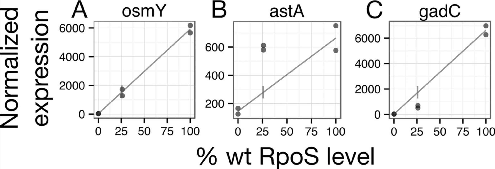
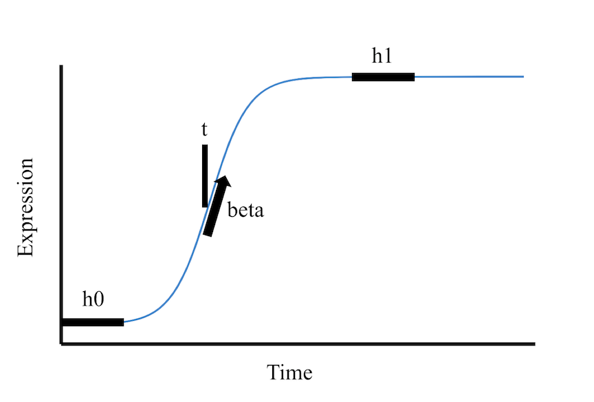
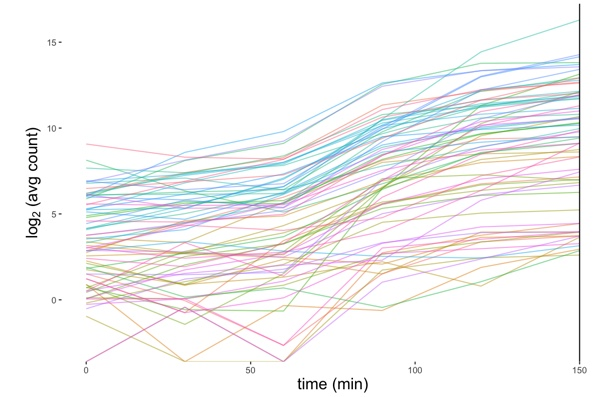

Affiliation: ^1^Department of Mathematics, Pomona College ^2^Department of Mathematics, Scripps College, ^3^Department of Biology, Harvey Mudd College ^4^NSF Data Science REU at Harvey Mudd College

## Abstract
  *E. coli* possesses a general stress response that coordinates physiological responses to many stressful stimuli including cell starvation during exponential growth. A key transcription factor in the general stress response, RpoS, is involved in the transcription of approximately one quarter of *E. coli's* genome. Groups of genes were previously classified by their kinetics with respect to RpoS concentration: genes with expressions that increase linearly with RpoS concentration ('linear' genes), genes that are transcribed *more* than anticipated under the linear hypothesis at low RpoS concentrations ('sensitive' genes), genes that are transcribed *less* than anticipated under the linear hypothesis at low RpoS concentrations ('insensitive' genes) (Wong *et al* 2017). Wong *et al.* proposed that the graded RpoS sensitivity of these genes could function as a mechanism to control the *timing* of genes invovled in *E. coli's* response to stress (Wong *et al* 2017). To address this question, DEGs were determined using a thoughtfully-constructed pipeline, and gene-wise sigmoidal models were fit to significant *E. coli* expression trajectories using ImpulseDE2. The dispersion robustness, impact of number of time points, and outlier robustness of the models' parameters were assessed by simulations. Visualization of the biologically meaningful "onset time" parameter of the sigmoidal model indicated that the *E. coli* genes all begin transcription at roughly the same time. While a significant difference between onset times for sensitive and insensitive genes was observed, the difference in onset times was small and not descriptive of the global trend of transcriptomic response. Implications and future directions are discussed. 

## Introduction
  E. coli possesses a general stress response to a variety of environmental stresses (Battesti *et al.* 2011, Hengge 2011) ranging from osmotic shock to nutrient starvation. A key transcription factor coordinating this response is RpoS, which regulates one quarter of the bacteria's genome (Fong *et al.* 2017). Simple interpretations of transcriptional networks often invoke an analogy of an on/off switch, in which the presence of a stimulus turns some genes on and other genes off. However, these simple interpretations don't adequately describe the complex, dyanmic processes underlying many transcriptional responses to stimuli. Currently, there exists a limited understanding regarding the dynamic nature of transcriptional responses, and the well-annotated, heavily-studied genome of E. coli presents an excellent model to study these intricate regulatory circuits.
  
  The RpoS regulon is not a static, 'switch-like' network; rather, the RpoS regulon is a highly complex regulatory circuit influenced by several factors including the duration/degree of stress (Lange and Hengge-Aronis 1994), processes like transcription, translation, and mRNA degradation (Lange and Hengge-Aronis 1994), other proteins (Pratt and Silhavy 1998), competition between transcription factors for RNA polymerase (Farewell *et al.* 1998), and even strain type (Hryckowian *et al.* 2014, Chiang *et al.* 2011). Wong and colleagues previously showed that several genes' expression increases linearly with Rpos concentration: these were dubbed 'linear' genes. However, several genes didn't follow this linear trend. Several genes were transcribed *more* than anticipated under the linear hypothesis at low RpoS concentrations: these were called 'sensitive' genes. Other genes were transcribed *less* than anticipated under the linear hypothesis at low RpoS concentrations: these were dubbed 'insensitive' genes (*Figure 1*) (Wong *et al.* 2017). Wong and colleagues hypothesized that sensitivity to Rpos could be a mechanism to control the **timing** of genes involved in the general stress response.
  
  
  
  We aimed to investigate this hypothesis using an extended time course RNA-seq dataset and an *in silico* tool, ImpulseDE2. ImpulseDE2 is a serial Time Course (TC) Differential Expression tool which fits impulse/sigmoidal models to expression trajectories and compares these dynamics models to constant/reduced models to determine differential expression over time or between time courses. The key advantage of ImpulseDE2 is that its models are parametrized by *biologically meaningful* parameters (ex. onset time), allowing researchers to leverage the parameter values to directly address biological questions (*Figure 2*).
  
  The impulse model is parametrized by 6 parameters: $h_0$ describes the initial/baseline amplitude (expression), $h_1$ describes the peak amplitude, $h_2$ describes the steady state amplitude, $t_1$ describes the time of the first transition (where the rise/fall is maximal), $t_2$ describes the time of the second transition, $\beta$ is the slope of both transitions. Not that the sigmoid model is just a simplification of the impulse model, where there is only one transition.
  
  
  
  The sigmoid model has the following parametric form:
  $$f_{\theta}(x)=\frac{1}{h_1} \cdot s(x, t_1, h_0, \beta)$$
  $$s(x, t, h, \beta)=h+(h_1-h)S(\beta, t)$$
  $$S(\beta, t)=\frac{1}{1+e^{-\beta(x-t)}}$$
  The impulse model sophisticates the sigmoid model by multiplying $f_{\theta}(x)$ by $$s(x, t_2, h_2, -\beta)$$
   
  We applied ImpulseDE2 to a TC RNA-Seq dataset generated by the Steobel lab. Two strains of *E. coli* - a WT strain and another strain, designated delta_RpoS, with the *rpos* gene knocked out - were subjected to a 150 minute cell starvation time course that stimulated RpoS production and changes in expression for many genes (*Figure 3*). A thoughtful pipeline employing best-performing time course differential expression methods ('DESeq2', 'NEXT maSigPro', and 'ImpulseDE2') was run on the dataset to identify differentially expressed genes. The onset time (`t`) parameter fitted by ImpulseDE2 was extracted and visualized for monotonically differentially expressed genes. Simulations were conducted to better understand and visualize the effects of dispersion, number of time points, and outliers on all sigmoidal parameters, including this 't' parameter. A Wilcox Rank Sum Test was applied to the timing parameters of sensitive and insensitive genes to test the hypothesis that different sensitivity to RpoS coordinates the timing of gene expression in response to stress.

```{r Rpos Kinetics 1, cache=TRUE, eval=T, echo=F, warning=FALSE, message=FALSE, results='hide', fig.keep='none'}
#visualize RpoS kinetics, load ggplot and read in data
library(ggplot2)
rposconc<-read.csv("meanExpToStationaryRpoSLevels.csv", header=T)
colnames(rposconc)<-c("Time", "Genotype", "Trial", "Experiment", "meanCultureDensity", "meanRpoS", "n")
#this generates a plot with meanRpoS concentrations over time for 3 trials (each trial had three reps at each TP)
ggplot(rposconc, aes(x=Time, y=meanRpoS, color=Trial))+geom_point(aes(size=meanCultureDensity))+ggtitle("RpoS Kinetics During Cell Starvation")+theme_bw()+labs(subtitle="3 replicates per trial, 3 trials")+ylab("meanRpoS conc. (M)")+geom_smooth()
```

```{r Rpos Kinetics 2, cache=TRUE, eval=T, echo=T, warning=FALSE, message=FALSE, results='hide', fig.keep='all'}
#simplify the plot encoded above to illustrate mean RpoS concentration over time
meanRpos<-aggregate(rposconc[, 6], list(rposconc$Time), mean)
colnames(meanRpos)<-c("Time", "Mean_RpoS")
ggplot(meanRpos, aes(x=Time, y=Mean_RpoS))+geom_point()+geom_smooth()+ggtitle("Mean RpoS kinetics over 150 min cell starvation time course (# TP= 6, n=9)")+xlab("Mean RpoS concentration (M)")+theme_bw()
```

*Figure 3: Mean RpoS kinetics over 150 min starvation time course. RpoS concentration increases steadily as starvation progresses, illustrating its stress-responsiveness.*

## Methods
### Data Description & Experimental Design
The Stoebel lab conducted the RNA-seq experiment as follows: three replicates of two E. coli strains, one mutant strain lacking the RpoS gene (delta-RpoS) and one WT strain containing the RpoS gene (WT), were subjected to 150 minute cell starvation time courses with RNA sampled at 30 min intervals.
The data was recieved in the format of a count matrix, with 37 columns. The column names specified the strain, timepoint, treatment, and replicate of the sample. "JH_01" or "JH_02" specifies the strain of *E. coli*: "JH_01" is the WT (treatment) "JH_02" is delta-RpoS (control). "A", "B", and "C" denotes the biological replicate and the number following it indicates the time point: "01" is 0, "02" is 30, "03" is 60, "04" is 90, "05" is 120, and "06" is 150 minutes.

### Data Pre-Processing
RNA-Seq data was obtained in the form of read count data. Code developed by Madison Hobbes was used to parse the gene identifiers, extract sequence type, gene names, and other useful information.
Since this experiment focuses on the kinetics of gene expression, the read count data was filtered for Coding Sequences (CDS's). Rows with NA counts and 0 counts were filtered out, and duplicate genes were resolved.

```{r, cache=TRUE, warning=FALSE, include=FALSE, eval=TRUE}
#load required packages and functions
library(DESeq2)
library(tidyverse)
library(ImpulseDE2)
library(maSigPro)
library(Mfuzz)
library(cluster)
library(factoextra)
library(VennDiagram)
library(ggplot2)
library(gridExtra)
library(grid)
library(gridGraphics)
library(reshape2)
library(gdata)
library(topGO)
library(org.EcK12.eg.db)
library(data.table)

#define functions
foo<-function(){}

sigmoid_function<-function(b, h_0, h_1, t_1, t){
h_0 + (h_1-h_0)*(1/(1+exp(1)^(-b*(t-t_1))))
}

impulse_function<-function(b, h_0, h_1, h_2, t_1, t_2, t){
  (1/h_1)*(h_0+(h_1-h_0)/(1+exp(-b*(t-t_1))))*(h_2+(h_1-h_2)/(1+exp(b*(t-t_2))))
}

enrich<-function(core, type){
  selection <- function(x) TRUE
  GeneList <- c(1:length(core))
  names(GeneList) <- core
  annot <- annFUN.org(whichOnto = type, feasibleGenes = NULL, mapping = "org.EcK12.eg", ID = "symbol")
  GOdata <- new("topGOdata", ontology=type, allGenes=GeneList, annot=annFUN.GO2genes, GO2genes = annot, geneSel = selection, nodeSize = 5)
  GO_results <- runTest(GOdata, algorithm = "classic", statistic = "ks")
  goEnrich <- GenTable(GOdata, KS = GO_results, orderBy = "KS", topNodes = 10)
  GO_terms<-goEnrich[,c("GO.ID", "Term", "KS")] %>% filter(KS<0.05)
  GO_terms
}

#read in data
allCounts <- read.csv("LB_Time_Course_GCA_000005845.2_ASM584v2_genomic_counts.tsv", header = T, sep = "\t")
```

```{r, echo=F, cache=TRUE, include=FALSE, eval=TRUE}
#collect the geneids
allCounts$GeneidBackup = allCounts$Geneid
# note that the geneids here are really long and contain a lot of information. We are going to parse those out, and first... make a separate column for gene feature (CDS, AS_CDS, IGR, etc).
```

```{r, include=F, cache=TRUE, warning=FALSE, include=FALSE, eval=TRUE}
library(tidyverse)
allCounts <- allCounts %>% tidyr::separate(GeneidBackup, c("feature", "rest"), sep="[:]")
allCounts %>% group_by(feature) %>% summarise(number_of_genes = n())
# Now, we must extract the genenames from each Geneid. However, each feature has a slightly different pattern, and we will need to do the features separately. 

# IGR's (this includes AS_IGRSs): 
# IGR stands for intergenic region which means a region between coding sequences or different types of RNA. Therefore, we'll have a start.bnum and end.bnum as well as a start.genename and end.genename. Note that not all genes will have a bnum (only CDS/AS_CDS do)
bnum = "b[0-9]{4}" # what do bnumbers look like?
genename = ",[a-z]{3}[A-Z,]." # what does a genename look like? this is regexp lingo
rna.name = ",rna[0-9].." # what does an RNA name look like?
igr <- allCounts %>% filter(feature %in% c("IGR", "AS_IGR"))
igr$GeneidBackup = igr$Geneid # store the Geneid
igr <- igr %>% separate(GeneidBackup, c("Geneid1", "Geneid2"), sep = "[/]") # separate the first part of the Geneid which talks about the IGR's start gene (Geneid1) and the last part of the IGR Geneid which talks about that IGR's end gene (Geneid2). 
igr$feature1 <- separate(igr, Geneid1, c("feature1", "rest"), sep = "[,]")$feature1
igr$feature1 <- separate(igr, feature1, c("rest", "feature1"), sep = "[()]")$feature1 #start feature
igr$feature2 <- separate(igr, Geneid2, c("feature2", "rest"), sep = "[,]")$feature2
igr$start.gene <- case_when( #start gene name: many possibilities!
    igr$feature1 == "CDS" ~ str_extract(igr$Geneid1, genename), #if the start feature was CDS, then the name is going to be genename style, so we extract a genename-type thing from Geneid1
    TRUE ~ str_extract(igr$Geneid1, rna.name)) #otherwise, it's going to have an RNA-style name, so we extract the rna.name from Geneid1
igr$end.gene <- case_when( #end gene neame: similar to above!
    igr$feature2 == "CDS" ~ str_extract(igr$Geneid2, genename), # if the end feature was CDS, then we're looking for a genename-type bit from Geneid2
    TRUE ~ str_extract(igr$Geneid2, rna.name)) #otherwise, it must be an RNA-style label of some sort. 
igr$start.bnum <- case_when(
    igr$feature1 == "CDS" ~ str_extract(igr$Geneid1, bnum), #bnums only exist for CDS, so we check if the feature is CDS before extracting a bnum from Geneid1
    TRUE ~ "none") # if not CDS, then no bnum exists so we can put "none"
igr$end.bnum <- case_when(
    igr$feature2 == "CDS" ~ str_extract(igr$Geneid2, bnum), #same thing as above but for end bnum
    TRUE ~ "none")
# now get rid of all those pesky commas that got into our start.gene labels. I could have not included the punctuation in my regex pattern, but then str_extract() might have gotten confused with a less specific pattern
igr <- igr %>% separate(start.gene, into = c("comma", "start.gene"), sep = "[,]") %>% dplyr::select(-comma) %>% separate(end.gene, into = c("comma", "end.gene"), sep = "[,]") %>% dplyr::select(-comma)
allCounts <- full_join(igr, allCounts) #add this new information to allCounts!
```

```{r, echo=F, warning = F, message = F, include=F, cache=TRUE, eval=TRUE}
# CDS
# have bnum and genename columns
# left join to allCounts
genename = ":[a-z]{3}.." #new genename pattern
#bnum pattern stays the same
cds <- allCounts %>% filter(feature %in% c("AS_CDS", "CDS")) 
cds$genename <- str_extract(cds$Geneid, genename) #extract those genenames!
cds$bnum <- str_extract(cds$Geneid, bnum) # extract them bnums!
#get rid of the pesky colon that was part of the pattern
cds <- cds %>% separate(genename, into = c("colon", "genename"), sep = ":") %>%
  dplyr::select(-colon)
allCounts <- full_join(allCounts, cds) #add the new info to allCounts
```

```{r, echo=F, warning = F, message = F, include=T, cache=TRUE, eval=TRUE}
#ncRNA
#ncRNA doesn't have bnums, but id's which we'll put in the genename column
rna.name = ":rna[0-9].." #new rna.name pattern
rna <- allCounts %>% filter(feature %in% c("ncRNA", "AS_ncRNA"))
rna$genename <- str_extract(rna$Geneid, rna.name) #record those rna.names
rna <- rna %>% separate(genename, into = c("colon", "genename"), sep = ":") %>%
  dplyr::select(-colon) #get rid of colon
allCounts <- full_join(allCounts, rna) #update allCounts with ncRNA names!
#rRNA
rRNA <- allCounts %>% filter(feature %in% c("rRNA", "AS_rRNA"))
rRNA$genename <- str_extract(rRNA$Geneid, rna.name) #same rna.name pattern exists as above, so extract those rna.names! And store the result as genename - I know. This is just for convenience's sake so we have a common column to refer to when we want the short hand name for a gene. 
rRNA <- rRNA %>% separate(genename, into = c("colon", "genename"), sep = ":") %>%
  dplyr::select(-colon) #get rid of that colon
allCounts <- full_join(allCounts, rRNA) #update allCounts
#tRNA -- analogous to rRNA above. 
tRNA <- allCounts %>% filter(feature %in% c("tRNA", "AS_tRNA"))
tRNA$genename <- str_extract(tRNA$Geneid, rna.name)
tRNA <- tRNA %>% separate(genename, into = c("colon", "genename"), sep = ":") %>%
  dplyr::select(-colon)
allCounts <- full_join(tRNA, allCounts)
# remove the NA rows we just created by full_joining while adding the ncRNA, rRNA, tRNA genenames
allCounts <- filter(allCounts, feature %in% c("IGR", "AS_IGR") | genename != "NA")

#filter by CDS, NA, 0 sums, resolve duplicates
#filter
ecounts<-allCounts %>% filter(feature=="CDS")
#remove NA and rows of 0's
ecounts<-ecounts[rowSums(is.na(ecounts)) != ncol(ecounts), ]
ecounts<-subset(ecounts, rowSums(ecounts[,2:37])>0)
#resolve duplicates (takes the first row corresponding to a genename)
ecounts<- ecounts %>% dplyr::distinct(genename, .keep_all=TRUE)
rownames(ecounts)<-ecounts$genename
ecounts<-ecounts[,2:37]
head(ecounts)
```

### Identifying Differentially Expressed Genes
  Three *in silico* differential expression tools were employed to identify DEGs between the WT and delta_RpoS time courses. Previous research shows that two-sample comparisons using DESeq2 and serial tools maSigPro and ImpulseDE2 are the best performing methods to identify differentially expressed genes in TC experiments (Spies *et al.* 2019). Morever, combining gene lists generated by multiple tools reduces false positives without compromising sensitivity and is thus recommended for optimal DEG identification in TC experiments (Spies *et al.* 2019). 
  
  **DESeq2** (Love *et al.* 2014) is an algorithm that models the read counts using a negative binomial distribution and uses a relative log expression (RLE) method to normalize the read count data across between-sample effects. DESeq2's main innovation is its Bayesian Shrunken Dispersion and LFC estimates, which improve stability and interpretability of these estimates and reproducibility of DE analysis (Love *et al.* 2014). DESeq2 is one of the most widely accepted and empolyed algorithms for differential expression analysis. However, DESeq2 is not built to analyze serial (time course) data, and its categorical treatment of serial data leads to loss in power to identify DEGs (Spies *et al. 2019*). Thus, DESeq2 alone is a suboptimal method to identify DEGs in TC experiments.
  
  **NEXT maSigPro** (Nueda *et al.* 2014) is a differential expression algorithm designed to analyze serial/TC RNA-Seq data. maSigPro models gene expression values using polynomial regression with a NB Generalized Linear Model. The model's parameters are fit using maximum likelihood, and the log likelihood ratio test is applied to the full model and the null model (a flat/alternative model fit to a control time course). In the second step of maSigPro, the goodness of fit, R^2^, is computed for each gene model, allowing filtering based on genes with clear expression trends. maSigPro requires data to be normalized *a priori* (we used the RLE method implemented through DESeq2) and contains a naive dispersion estimate of 10, which according to the authors does not have a substantial impact on downstream DEG identification (Nueda *et al.* 2014). Dispersion accounts for the additional variability introduced by biological replicates to the negative binomial model (which is used to model the read count data), and it's estimation is an important step that other DE tools have afforded significant work (e.g. DESeq2). Nonetheless, maSigPro is a robust DE tool designed for analysis and interpretation of TC RNA-Seq data.
  
  **ImpulseDE2** (Fischer *et al.* 2018) is another differential expression algorithm designed to analyze serial/TC RNA-Seq data. ImpulseDE2 fits impulse/sigmoidal models to the read count data by estimating the parameters using the Broyden–Fletcher–Goldfarb–Shanno algorithm (Broyden 1970, Fletcher 1970, Goldfarb 1970, Shanno 1970). Gene-wise dispersion estimates are generated using the Bayesian shrinkage approach used in DESeq2. Differential expression is assessed using the log likelihood ratio test comparing the likelihood of the alternative and null (flat or control fit) models.
  
  Using a shiny app created by Annie Cohen, we noticed that many of E. Coli's DEGs appeared montonically differentially expessed. In addition, the sensitive/insenstitive/linear prototype profiles were all monotonic (only increased, only decreased). To capture this global expression change, we ran the categorical DE tool DESeq2 with a two-sample contrast across the delta_Rpos and WT strains at the final time point (150min) and intersected the DEG list with a one-sample contrast in the WT strainn from 0 to 150 mins. maSigPro was run with default arguments and results were filtered by $R^2$ of 0.6 to obtain DEGs with relatively clear expression trends. ImpulseDE2 was run with defaults and with the specification to differentiate between transient (impulse) and monotonic (sigmoidal/linear) DEGs.
  
\setcounter{figure}{3}
  
  
  Genes that were identified as significantly differentially expressed at a Benjamini-Hochberg corrected p value (Benjamini-Hochberg, 1995) of less than 0.01 by ImpulseDE2 and at least one additional tool were included in our DEG list. 1007 genes were labeled as DE and were subjected to further analysis (*Figure 4*).
  
```{r DE Tools, cache=TRUE, eval=TRUE, echo=FALSE, warning=FALSE, message=FALSE, error=FALSE, results='hide', fig.keep='all'}
####################################################################################################################
#DESeq2
####################################################################################################################
colidesign<-data.frame(time=as.factor(rep(c("0", "30", "60", "90", "120", "150"), 6)), rep=as.factor(c(rep(1, 12), rep(2,12), rep(3,12))), treatment=as.factor(c(rep("WT",6), rep("treat",6), rep("WT",6), rep("treat",6), rep("WT",6), rep("treat",6)))) %>%
  mutate(timetreat=paste(treatment, time, sep=""))

ddsecoliCountTable <- DESeqDataSetFromMatrix(
  countData = ecounts,
  colData = colidesign,
  design = ~ timetreat)

#ID'ed 728 DEGs w/ padj<0.01
#ID genes DE over time (0 min to 150 min in WT strain)
ecolidds<-DESeq(ddsecoliCountTable)
res<-results(ecolidds, contrast=c("timetreat", "WT150", "WT0"))
res<-res[complete.cases(res),]
res<- res[res$padj<0.01,]
#ID genes DE over treatment (150 min between WT and dRpoS strains)
res1<-results(ecolidds, contrast=c("timetreat", "WT150", "treat150"))
res1<-res1[complete.cases(res1),]
res1<- res1[res1$padj<0.01,]
#intersect these two results
res<-intersect(rownames(res1), rownames(res))

#####
#ImpulseDE2
#####
stoebeldesign<-data.frame(Sample=colnames(ecounts), Condition=c(rep("case",6), rep("control",6), rep("case",6), rep("control",6), rep("case",6), rep("control",6)), Time=rep(c(0,30,60,90,120,150),6))

impulse_ecoli<-ImpulseDE2::runImpulseDE2(as.matrix(ecounts), stoebeldesign, boolCaseCtrl=TRUE, vecConfounders=NULL, scaQThres = 0.01, boolIdentifyTransients = TRUE, boolVerbose=FALSE)

###################################################################################################################################
#Serial expression tool: NEXT maSigPro
###################################################################################################################################

#set up design
Time<-rep(c(0,30,60,90,120,150),6)
Replicate<-rep(1:3, 12)
Control<-c(rep(0, 6), rep(1, 6), rep(0, 6), rep(1, 6), rep(0, 6), rep(1,6))
delta_Rpos<-c(rep(1, 6), rep(0, 6), rep(1, 6), rep(0, 6), rep(1, 6), rep(0, 6))
edesign<-cbind(Time, Replicate, Control, delta_Rpos)
rownames(edesign)<-colnames(ecounts)

#run maSigPro on DESeq2 Normalized Counts, theta=10, Q=0.01
normecounts<-as.data.frame(counts(ecolidds, normalized=TRUE))
stobdesign<-make.design.matrix(edesign, degree=5)

#ID DEGs
fits<-p.vector(normecounts, stobdesign, Q=0.01, MT.adjust = "BH", min.obs=6, counts=TRUE)
#variable selection procedure to ID variables for each gene
tsep<-T.fit(fits, step.method = "backward", alfa=0.01)

#Get sig genes between delta_RpoS and Control
sigs <- get.siggenes(tsep, rsq = 0.6, vars = "groups")
maSigProGenes<-sigs$summary$delta_RposvsControl

area1 <- length(intersect(res,maSigProGenes))
area2<- length(intersect(impulse_ecoli$vecDEGenes,res))
area3 <- length(intersect(maSigProGenes, impulse_ecoli$vecDEGenes))
area123<-length(intersect(intersect(maSigProGenes, impulse_ecoli$vecDEGenes), intersect(maSigProGenes,res)))

#draw venn diagram of DEG overlaps
draw.triple.venn(area1= length(res), area2 = length(maSigProGenes), area3= length(impulse_ecoli$vecDEGenes), n12=area1, n23=area3, n13=area2, n123=area123, category = c("DESeq2","maSigPro", "ImpulseDE2"), lty = rep("blank",3), fill = c("light blue", "light green", "pink"), cex=rep(3, 7), cat.cex=rep(2.25,3), cat.dist=c(0,0,0), cat.fontface = "bold")
```

```{r DEGs, cache=TRUE, eval=T, echo=FALSE}
###################################################################################################################
#Generate final DEG list: 912 genes
###################################################################################################################
ecoli_DEGs<-union(intersect(impulse_ecoli$vecDEGenes, maSigProGenes), intersect(impulse_ecoli$vecDEGenes, res))

#write.csv(ecoli_DEGs, "ecoli_DEGs.csv")
#ecoli_DEGs<-read.csv("ecoli_DEGs.csv")
```

*Figure 4: Venn diagram illustrating numbers and intsersections of DEGs identified by each differential expression tool. DEGs were identified as genes identified by ImpulseDE2 and at least one other tool (912 total).*

### Simulations for Assessment of Sigmoidal Model Parameters
Simulations were conducted to understand the effects of dispersion, number of time points, and outliers on the sigmoid model's parameters. The simulation structure took in mean read counts estimated from the fit of a sigmoidal model to a real *E. coli* gene. The sigmoid model fit to the real gene was considered to be **truth** for our simulation. Simulated read count data were generated around the true means using 'rnbinom(n,size,mu)' in the R package 'stats', where 'n' was the number of samples at that parctiular TP, 'size' was the ImpulseDE2-estimated dispersion parameter for that gene, and 'mu' was the true mean expression at that TP. Thus, an appropriate level of NB noise was added to the 'true' sigmoid profile. This process was iterated 100 times, generating data for 100 simulated gene expression trajectories.
Then, sigmoidal models were fit to the simulated trajectories using ImpulseDE2, and the distribution of simulated parameters were compared to the initial parameter values. Thus, simulated sigmoid trajectories were generated from a 'null trajectory', and the stability and variability of the simulated parameters could be assessed to learn more about this model's application through the ImpulseDE2 package. 

## Results
### *Visualizing onset times for DEGs and Sensitive/Insensitive Genes*

For genes identfied as differentially expressed by our pipeline, onset timing parameters were extracted and plotted in a density histogram. Differentially expressed genes were divided into three groups according to their trajectories: monotonic, transient, and unknown trajectories (this determination is made by ImpulseDE2 by testing null vs alternative models). Monotonic DEGs were the most abundant (685), followed by unknown (188), followed by transient (39). Monotonic expression trajectories were described using the *sigmoid model* parametrized by four parameters. Transient trajectories were described using the *impulse model*, an extension of the sigmoid model that describes the on/off dyanmics by taking the scaled product of two sigmoid functions.

The distribution of t params for monotonic DEGs obtained from sigmoid models were plotted. Around 92% of the monotonic DEGs have onset times between 55 and 75 minutes (*Figure 5*), suggesting that the vast majority of monotonic DEGs turn on at around the same time.

Interestingly, the vast majority of onset time params for genes identified as *transiently* differentially expressed fell around the 14 minute mark (*Figure 6*).

```{r Visualizing t params: mono, impulse, sens, insens, cache=TRUE, warning=FALSE, eval=T, echo=FALSE, results='hide', fig.keep='all'}
#########
#Visualize t params from monotonic genes, impulse genes
#########
DEmono<- impulse_ecoli$dfImpulseDE2Results[impulse_ecoli$dfImpulseDE2Results$isMonotonous==TRUE,] %>% filter(padj<0.01) %>% filter(Gene %in% ecoli_DEGs)
DEtrans<-impulse_ecoli$dfImpulseDE2Results[impulse_ecoli$dfImpulseDE2Results$isTransient==TRUE,] %>% filter(padj<0.01) %>% filter(Gene %in% ecoli_DEGs)
DEother<-impulse_ecoli$dfImpulseDE2Results %>% filter(padj<0.01) %>% filter(isTransient==FALSE) %>% filter(isMonotonous==FALSE) %>% filter(Gene %in% ecoli_DEGs)

#pull out sigmoid params for each of the monotonic DEGs
monoDE<-DEmono$Gene
monoparamsmat<-matrix(ncol=4, nrow=length(monoDE))
for (i in 1:length(monoDE)){
   monoparamsmat[i,]<-impulse_ecoli@lsModelFits[["case"]][[monoDE[i]]][["lsSigmoidFit"]][["vecSigmoidParam"]]}
monoparamsdf<-as.data.frame(monoparamsmat)
colnames(monoparamsdf)<-c("beta", "h0", "h1", "t")
rownames(monoparamsdf)<-monoDE

#t params of montonic genes, looks somewhat bi/trimodal
ggplot(monoparamsdf, aes(x=t))+geom_density(color="blue", fill="cyan", binwidth=1)+xlim(50,100)+ggtitle("Distribution of sigmoid t params of 685 monotonic E. coli DEGs")+theme_bw()+theme(plot.title=element_text(size=18), axis.title = element_text(size=15), axis.text = element_text(size=12))

#t1 params of transient genes... multimodal but greatest peak @ 14 min
transDE<-na.omit(DEtrans$Gene)
transparamsmat<-matrix(ncol=6, nrow=length(transDE))
for (i in 1:length(transDE)){
   transparamsmat[i,]<-impulse_ecoli@lsModelFits[["case"]][[transDE[i]]][["lsImpulseFit"]][["vecImpulseParam"]]}
transparamsdf<-as.data.frame(transparamsmat)
colnames(transparamsdf)<-c("beta", "h0", "h1", "h2", "t1", "t2")
rownames(transparamsdf)<-transDE
ggplot(transparamsdf, aes(x=t1))+geom_histogram(color="blue", fill="cyan", alpha=0.5, binwidth=0.5)+ xlim(0,100)+ggtitle("Distribution of 39 impulse t1 params of transient E. coli DEGs")
```

*Figure 5: Density histogram of counts of sigmoid onset time (t) parameters of 686 montonic E. coli DEGs. Thus, onset time expression for monotonic DEGs appears highly concomitant (55-75 mins).*

```{r Plotting Other and Transient DEGs, eval=F, echo=F}
#faceted plots for all transient DEGs
plot_trajectories<-matrix(nrow=151, ncol=dim(transparamsdf)[1])
rownames(plot_trajectories)<-seq(0,150,1)
colnames(plot_trajectories)<-rownames(transparamsdf)
for (i in 1:dim(transparamsdf)[1]){
  tmpsim<-transparamsdf[i,]
  plot_trajectories[,i]<-impulse_function(b=tmpsim$beta, h_0=tmpsim$h0, h_1=tmpsim$h1, h_2=tmpsim$h2, t_1=tmpsim$t1, t_2=tmpsim$t2, t=seq(0,150,1))
}
plot_trajectories<-as.data.frame(plot_trajectories)
plot_trajectories$time<-seq(0,150,1)
df <- melt(plot_trajectories ,  id.vars = 'time', variable.name = 'series')
ggplot(df, aes(x=time,y=log2(value))) + geom_line(aes(colour = series)) +facet_wrap(~series)+theme_bw()+theme(legend.position = "none")+ggtitle("Trajectory Plots of Transient DEGs")

#what about these mysterious "other" genes: not transient nor monotonically DE
DEother$Gene[DEother$Gene %in% sensitive$geneName]
DEother$Gene[DEother$Gene %in% insensitive$geneName]
DEother$Gene[DEother$Gene %in% linear$geneName]

#plot other genes
set.seed(13)
WT_counts<-normecounts[,grepl("JH01", colnames(normecounts))]
other_genes<-c("ybeM", sample(DEother$Gene[DEother$sigmoidTOconst_padj<0.01], 11))
plot_list<-list()
for (i in 1:length(other_genes)){
  index=match(other_genes[i], rownames(WT_counts))
  tmpdf<-as.data.frame(cbind(rep(c(0,30,60,90,120,150), 3), t(WT_counts[index,])))
  rownames(tmpdf)<-NULL
  colnames(tmpdf)<-c("time", "exp")
  plot_list[[i]]<-ggplot(tmpdf, aes(x=time, y=exp))+ggtitle(as.character(other_genes[i]))+geom_point()+geom_smooth()}
do.call(grid.arrange, c(plot_list[1:6], ncol=2, nrow=3))
do.call(grid.arrange, c(plot_list[7:12], ncol=2, nrow=3))
```

*Figure 6: Histogram of counts of impulse onset time (t_1) parameters of 29 transient E. coli DEGs. Here, onset time expression also appears highly concomitant (14 mins)*

## *Simulations*

To better understand the effects of dispersion, number of time points, and outliers on the sigmoid model's biologically-meaningful parameters, simulations were conducted based off a sigmoid profile fit to a real *E. coli* DEGs. We chose to primarily focus on a single E. coli DEG, the insenstive gene gadB. Focusing on a single gene would allow us to gain insights into how noise, number of time points, and outliers impact the stability of the model by eliminating differences between geens. We chose gadB due to its high differential expression, clear expression profile, and high interest by Dan Stoebel.  In the following plots of simulated sigmoid trajectories, the vertical dark-blue lines represent the *initial onset time* (t) parameter used to generate all the simulated sigmoid functions. The vertical magenta line represents the median *simulated onset time* parameter.

### Effect of Dispersion on Sigmoid Parameters

The ascertain the effect of dispersion-based noise on the sigmoid parameters (onset time parameter (t), slope parameter (beta), and peak-initial value (h1-h0)), a simulation pipeline was constructed. This pipeline generated sigmoid profiles based off the initial 'true' profile using the rnbinom() function, which generated simulated read counts that sigmoid profiles could be fit to using ImpulseDE2. To assess the impact of dispersion noise, the *a priori* DESeq2-shrunk dispersion parameter estimate was multiplied by 15 different factors between 0.01 and 100, simulating the effect of a 100-fold decrease and a 100-fold increase in noise. Then these altered dispersion parameters were supplied to rnbinom(), simulated read counts were generated, and the stability and variability of the parameters were assessed.

In addition, plots of all the simulated trajectories were overlaid with a plot of the initial trajectory at different levels of noise. 

The slope parameter (beta) parameter was the least stable of the parameters assayed, as its scaled root mean squared error was the highest of any parameter examined, and a small change in dispersion resulted in a rapid increase in error, suggesting that beta is extremely sensitive to dispersion noise (*Figure 7*). 

The peak-initial expression parameter (h1-h0) was also not stable (*Figure 7*). While this parameter displayed an intermediate scaled root mean squared error, as the dispersion increased, the error increased in a monotonic fashion, suggestive that h1-h0 parameter, while relatively stable at low dispersions, is quite sensitive to high dispersions.

At all dispersions surveyed between 0.02 (1/100 fold reduction in noise) and 1130 (500 fold increase in noise), the onset time (t) parameter had the lowest scaled root mean squared error of the 3 variables assayed (*Figure 7*), suggesting that the t parameter was more stable than other parameters. In addition, the t parameter's error plateued as the dispersion level increased, suggesting that the t parameter is robust to high dispersions.

```{r Noise Assessment, cache=TRUE, warning=FALSE, eval=T, echo=FALSE, results='hide', fig.keep='all'}
set.seed(10)

noise_assessment<-function(gene="gadB", disp_factors, n_sim_profiles=100){
  #times
  times<-rep(c(0,30,60,90,120,150),6)
  #design for sigmoid simulation through ImpulseDE2
  sigmoid_design<-data.frame(Sample=colnames(ecolidds)[grep("JH01", colnames(ecolidds))], Condition=c(rep("case",18)), Time=rep(c(0,30,60,90,120,150),3))
  #create final matrix to put params into
  params_mat<-matrix(ncol=length(disp_factors), nrow=3)
  #find initial param values
  geneparams<-monoparamsdf[match(gene, rownames(monoparamsdf)),]
  ###extract means at each TP, scale by size factor
  size_facs<-sizeFactors(ecolidds)[grep("JH01", names(sizeFactors(ecolidds)))]
  means<-sigmoid_function(as.numeric(geneparams[1]), as.numeric(geneparams[2]), as.numeric(geneparams[3]), as.numeric(geneparams[4]), unique(times))
  #index to find initial dispersion for gene
  disp_index=match(gene, names(impulse_ecoli@vecDispersions))
  disp<-as.numeric(impulse_ecoli@vecDispersions[disp_index])
  repmeans<-c(rep(means, 3))
  for (j in 1:length(disp_factors)){
    #generate simulated read count data for 100 trajectories w/ proper NB noise, add one to each count to ensure no rows of all zero counts
    differentially_expressed<-matrix(ncol=18, nrow=n_sim_profiles)
    for (i in 1:18){
      expressions<-c()
      expressions<-c(expressions, rnbinom(n=n_sim_profiles, mu=repmeans[i], size=disp/disp_factors[j])+1)
      differentially_expressed[,i]<-round(expressions*as.numeric(size_facs[i]))
      }
    differentially_expressed<-as.matrix(differentially_expressed)
    colnames(differentially_expressed)<-colnames(ecolidds)[grep("JH01", colnames(ecolidds))]
    rownames(differentially_expressed)<-paste(rep("gene", n_sim_profiles), seq(1, n_sim_profiles))
    #set manual dispersions
    dispersions<-rep(disp, n_sim_profiles)
    names(dispersions)<-paste(rep("gene", n_sim_profiles), seq(1,n_sim_profiles))
    #fit impulse models
    sim_sigmoid<-ImpulseDE2::runImpulseDE2(differentially_expressed, sigmoid_design, boolCaseCtrl=FALSE, vecConfounders=NULL, boolIdentifyTransients=TRUE, scaNProc=12, scaQThres = 0.01, vecDispersionsExternal = dispersions, vecSizeFactorsExternal = size_facs, boolVerbose=FALSE)
  #extract simulated params
  sim_params_to_plot<-matrix(ncol=4, nrow=n_sim_profiles)
  for (i in 1:n_sim_profiles){
    sim_params_to_plot[i,]<-as.vector(sim_sigmoid@lsModelFits[["case"]][[rownames(sim_sigmoid$dfImpulseDE2Results, n_sim_profiles)[i]]][["lsSigmoidFit"]][["vecSigmoidParam"]])}
  colnames(sim_params_to_plot)<-c("beta", "h0", "h1", "t")
  sim_params_to_plot<-as.data.frame(sim_params_to_plot)
  params_mat[1,j]<-sqrt(mean((geneparams$beta-sim_params_to_plot$beta)^2))/geneparams$beta
  params_mat[2,j]<-sqrt(mean((geneparams$t-sim_params_to_plot$t)^2))/geneparams$t
  params_mat[3,j]<-sqrt(mean(((geneparams$h1-geneparams$h0)-(sim_params_to_plot$h1-sim_params_to_plot$h0))^2))/(geneparams$h1-geneparams$h0)
}

error_as_function_of_noise<-as.data.frame(t(params_mat))
colnames(error_as_function_of_noise)<-c("Beta", "t", "h1-h0")
error_as_function_of_noise$dispersion<-disp*disp_factors
error_df<-melt(error_as_function_of_noise, id.vars="dispersion")
colnames(error_df)<-c("Dispersion", "param_type", "Scaled_RME")

ggplot(error_df)+geom_line(aes(x=Dispersion, y=log(Scaled_RME), group=param_type, color=param_type))+geom_point(aes(x=Dispersion, y=log(Scaled_RME), group=param_type, color=param_type))+facet_wrap(~param_type)+theme_bw()+ggtitle("Effect of Increased Dispersion Noise on Log scaled RME of Sigmoid Parameters")+labs(subtitle=paste(n_sim_profiles, "simulated profiles", " "))
}

noise_assessment("gadB", disp_factors=c((1/100), (1/10), 1, 20, 40, 60, 80, 100, 150, 200, 250, 300, 350, 400, 500), n_sim_profiles=100)
```

*Figure 7: Log scaled RM Error of the Beta, t, and h1-h0 sigmoid parameters as a function of dispersion noise (number of simulated profiles=100). Onset time (t param) shows lowest scaled error around the 'true', initial parameter value, and the error levels off at high dispersion values.*

```{r Plot Trajectories with Noise, cache=T, eval=T, echo=FALSE, message=FALSE, results='hide', fig.keep='all'}
set.seed(11)
plot_sim_trajectories<-function(gene="gadB", disp_noise_factor=1, n_sim_profiles=100){
  times<-rep(c(0,30,60,90,120,150),6)

  #design for sigmoid simulation through ImpulseDE2
  sigmoid_design<-data.frame(Sample=colnames(ecolidds)[grep("JH01", colnames(ecolidds))], Condition=c(rep("case",18)), Time=rep(c(0,30,60,90,120,150),3))
  geneparams<-monoparamsdf[match(gene, rownames(monoparamsdf)),]

  ###extract means at each TP, scale by size factor
  size_facs<-sizeFactors(ecolidds)[grep("JH01", names(sizeFactors(ecolidds)))]
  means<-sigmoid_function(as.numeric(geneparams[1]), as.numeric(geneparams[2]), as.numeric(geneparams[3]), as.numeric(geneparams[4]), unique(times))
  repmeans<-c(rep(means, 3))

#index to find dispersion for gadB
  disp_index=match(gene, names(impulse_ecoli@vecDispersions))
  disp<-as.numeric(impulse_ecoli@vecDispersions[disp_index])

  #generate simulated read count data for 100 trajectories w/ proper NB noise
  differentially_expressed<-matrix(ncol=18, nrow=n_sim_profiles)
  for (i in 1:18){
    expressions<-c()
    #pseudo-counts (+1) to ensure that nonzero
    expressions<-c(expressions, rnbinom(n=n_sim_profiles, mu=repmeans[i], size=disp/disp_noise_factor)+1)
    differentially_expressed[,i]<-round(expressions*as.numeric(size_facs[i]))
  }
  differentially_expressed<-as.matrix(differentially_expressed)
  colnames(differentially_expressed)<-colnames(ecolidds)[grep("JH01", colnames(ecolidds))]
  rownames(differentially_expressed)<-paste(rep("gene", n_sim_profiles), seq(1,n_sim_profiles))
  
  #set manual dispersions
  dispersions<-rep(disp, n_sim_profiles)
  names(dispersions)<-paste(rep("gene", n_sim_profiles), seq(1,n_sim_profiles))
  
  #fit impulse models
  sim_sigmoid<-ImpulseDE2::runImpulseDE2(differentially_expressed, sigmoid_design, boolCaseCtrl=FALSE, vecConfounders=NULL, boolIdentifyTransients=TRUE, scaNProc=12, scaQThres = 0.01, vecDispersionsExternal = dispersions, vecSizeFactorsExternal = size_facs, boolVerbose=FALSE)

  #extract simulated params
  sim_params_to_plot<-matrix(ncol=4, nrow=n_sim_profiles)
  for (i in 1:n_sim_profiles){
    sim_params_to_plot[i,]<-as.vector(sim_sigmoid@lsModelFits[["case"]][[rownames(sim_sigmoid$dfImpulseDE2Results, n_sim_profiles)[i]]][["lsSigmoidFit"]][["vecSigmoidParam"]])}
  colnames(sim_params_to_plot)<-c("beta", "h0", "h1", "t")
  sim_params_to_plot<-as.data.frame(sim_params_to_plot)

#plot all expression trajectories on the same plot
plot_trajectories<-matrix(nrow=6, ncol=n_sim_profiles+1)
rownames(plot_trajectories)<-unique(times)
colnames(plot_trajectories)<-c("init", paste(rep("gene", n_sim_profiles), seq(1,n_sim_profiles)))
plot_trajectories[,1]<-means
for (i in 1:n_sim_profiles){
  tmpsim<-sim_params_to_plot[i,]
  plot_trajectories[,i+1]<-sigmoid_function(tmpsim$beta, tmpsim$h0, tmpsim$h1, tmpsim$t, unique(times))
}

#compute correlations
scores<-rep(cor(plot_trajectories, method="spearman")[,1], each=6)

counts_to_plot<-ecounts[match(gene, rownames(ecounts)),grep("JH01", colnames(ecounts))]*size_facs
counts_to_plot<-rbind(counts_to_plot, differentially_expressed)
counts_to_plot<-as.data.frame(t(counts_to_plot))
counts_to_plot$time<-times[1:18]

df <- melt(counts_to_plot ,  id.vars = 'time', variable.name = 'series')

plot_trajectories<-as.data.frame(plot_trajectories)
plot_trajectories$time<-unique(times)
plot_trajectories <- melt(plot_trajectories ,  id.vars = 'time', variable.name = 'series')
plot_trajectories$score<-scores

e<-ggplot(plot_trajectories[plot_trajectories$series!="init",], aes(x=time,y=log2(value),group=series)) + theme(legend.position ="none") + geom_line(aes(color=score), alpha=0.5, size=0.5)+ scale_color_gradient2(low = "yellow", mid="orange", high = "red", name="Score", breaks=waiver(), limits=c(-1, 1), position="right", space="Lab", guide="colourbar", aesthetics = "colour")+geom_line(data=plot_trajectories[plot_trajectories$series=="init",], aes(x=time, y=log2(value)),size=1, alpha=1)+theme_bw()+ggtitle(paste(gene, ": Plots of all simulated expression trajectories", sep=" ")) + geom_jitter(data=df, aes(x=time, y=log2(value)), alpha=0.3, color="gray47",size=0.5)+scale_x_continuous("time", breaks=c(0,30,60,90,120,150), labels=c(0,30,60,90,120,150))+geom_vline(xintercept=monoparamsdf[gene,]$t, linetype="dashed", color="darkblue", size=0.5)+geom_vline(xintercept=mean(sim_params_to_plot$t), linetype="dashed", color="magenta")+labs(subtitle=paste("Disp:", round(disp*disp_noise_factor,2), ", SD(t params):" , round(sd(sim_params_to_plot$t), 2), sep= " "))
print(e)
}

a<-plot_sim_trajectories(disp_noise_factor = 1)
b<-plot_sim_trajectories(disp_noise_factor = 100)
c<-plot_sim_trajectories(disp_noise_factor = (1/100))
```

```{r Grid Trajectories with Noise, cache=T, eval=F, echo=FALSE, message=FALSE, results='hide', fig.keep='all'}
print(grid.arrange(a, b, c, ncol=2, nrow=2))
```

*Figure 8: Top Left: 'True' sigmoid trajectory (black) and 100 simulated sigmoid trajectories (color indicates spearman correlation to true trajectory) with DESeq2-derived dispersion estimate (normal dispersion). Dark blue dashed line indicates the 'true' t parameter and the dashed magenta line indicates the mean simulated t parameter. The standard deviation of simulated t parameters is included in plot subtitle. Top Right: 'True' sigmoid trajectory (black) and 100 simulated sigmoid trajectories with dispersion noise increased 100-fold. Increased dispersion noise caused high variability in the shapes of the profiles, but the mean simulated t parameter did not shift from the 'true' value. The SD of the t parameters also increased in response to increase in noise. Bottom Left: 'True' sigmoid trajectory (black) and 100 simulated sigmoid trajectories with dispersion noise decreased 100-fold. Decreased dispersion noise reduced variability in shapes of the profiles, and SD of the t parameters decreased.*

```{r Normal Dispersion Sim, cache=T, eval=F, echo=FALSE, message=FALSE, results='hide', fig.keep='all'}
##############################################################################################################
#Simulate Sigmoid/Impulse E. Coli Data to better understand parameter confidence & upholster timing conclusions
##############################################################################################################

###################
#gadB simulation (no params changed)
###################
#times
times<-rep(c(0,30,60,90,120,150),6)

#design for sigmoid simulation through ImpulseDE2
sigmoid_design<-data.frame(Sample=colnames(ecolidds)[grep("JH01", colnames(ecolidds))], Condition=c(rep("case",18)), Time=rep(c(0,30,60,90,120,150),3))

###Ex. select one gene (gadB), extract impulse fit, and generate 100 simulated trajectories based off that one gene. Then plot all the trajectories and data on same plot. Plot distributions of sigmoid params for simulated data as well. May take a couple mins
set.seed(10)
genes<-c('gadB')

for (k in 1:length(genes)){
geneparams<-monoparamsdf[match(genes[k], rownames(monoparamsdf)),]

###extract means at each TP, scale by size factor
size_facs<-sizeFactors(ecolidds)[grep("JH01", names(sizeFactors(ecolidds)))]
means<-sigmoid_function(as.numeric(geneparams[1]), as.numeric(geneparams[2]), as.numeric(geneparams[3]), as.numeric(geneparams[4]), unique(times))
repmeans<-c(rep(means, 3))

#index to find dispersion for gadB
disp_index=match(genes[k], names(impulse_ecoli@vecDispersions))
disp<-as.numeric(impulse_ecoli@vecDispersions[disp_index])

#generate simulated read count data for 100 trajectories w/ proper NB noise
differentially_expressed<-matrix(ncol=18, nrow=100)
for (i in 1:18){
  expressions<-c()
  expressions<-c(expressions, rnbinom(n=100, mu=repmeans[i], size=disp))
  differentially_expressed[,i]<-round(expressions*as.numeric(size_facs[i]))
}
  differentially_expressed<-as.matrix(differentially_expressed)
  colnames(differentially_expressed)<-colnames(ecolidds)[grep("JH01", colnames(ecolidds))]
  rownames(differentially_expressed)<-paste(rep("gene", 100), seq(1,100))
  
  #set manual dispersions
  dispersions<-rep(disp, 100)
  names(dispersions)<-paste(rep("gene", 100), seq(1,100))
  
  #fit impulse models
  sim_sigmoid<-ImpulseDE2::runImpulseDE2(differentially_expressed, sigmoid_design, boolCaseCtrl=FALSE, vecConfounders=NULL, boolIdentifyTransients=TRUE, scaNProc=12, scaQThres = 0.01, vecDispersionsExternal = dispersions, vecSizeFactorsExternal = size_facs, boolVerbose=FALSE)

  #extract simulated params
  sim_params_to_plot<-matrix(ncol=4, nrow=100)
  for (i in 1:100){
    sim_params_to_plot[i,]<-sim_sigmoid@lsModelFits[["case"]][[rownames(sim_sigmoid$dfImpulseDE2Results, 100)[i]]][["lsSigmoidFit"]][["vecSigmoidParam"]]}
  colnames(sim_params_to_plot)<-c("beta", "h0", "h1", "t")
  sim_params_to_plot<-as.data.frame(sim_params_to_plot)

  #create empirical cdfs of simulated param values to compare initial values to
  betadens<-ecdf(sim_params_to_plot$beta)
  tdens<-ecdf(sim_params_to_plot$t)
  peakdens<-dens<-ecdf(sim_params_to_plot$h1-sim_params_to_plot$h0)
  
  
#plot distributions of params
b<-ggplot(sim_params_to_plot, aes(x=beta, y=..density..))+geom_density()+geom_vline(xintercept=geneparams$beta, color="red", show.legend = TRUE)+ggtitle(paste("Param Dist. of 100 E coli genes simulated from", genes[k], "w/ disp.=", round(disp, 2), sep=" "))+labs(subtitle=paste("Params: beta", round(as.numeric(geneparams[1]), digits=2), ",", names(geneparams[2]), round(as.numeric(geneparams[2]), digits=2), ",", names(geneparams[3]), round(as.numeric(geneparams[3]), digits=2), ",", names(geneparams[4]), round(as.numeric(geneparams[4]), digits=2)))+theme(plot.title = element_text(size = 9, face = "bold"), plot.subtitle = element_text(size = 7, face = "italic"))+xlim(round(range(monoparamsdf$beta)))+annotate(geom="text", -Inf, Inf, hjust=-3, vjust=0.99, label=paste(betadens(as.numeric(geneparams[1])), "quantile", sep = " "), color="red", size=3)
c<-ggplot(sim_params_to_plot, aes(x=t, y=..density..))+geom_density()+geom_vline(xintercept=geneparams$t, color="blue")+xlim(round(range(monoparamsdf$t)))+annotate(geom="text", -Inf, Inf, hjust=-3, vjust=0.99, label=paste(tdens(as.numeric(geneparams[4])), "quantile", sep = " "), color="blue", size=3)
d<-ggplot(sim_params_to_plot, aes(x=h1-h0, y=..density..))+geom_density()+geom_vline(xintercept=geneparams$h1-geneparams$h0, color="green")+xlim(-80000, 80000)+annotate(geom="text", -Inf, Inf, hjust=-3, vjust=0.99, label=paste(peakdens(as.numeric(geneparams[3])-as.numeric(geneparams[2])), "quantile", sep = " "), color="darkgreen", size=3)

#plot all expression trajectories on the same plot
plot_trajectories<-matrix(nrow=6, ncol=101)
rownames(plot_trajectories)<-unique(times)
colnames(plot_trajectories)<-c("init", paste(rep("gene", 100), seq(1,100)))
plot_trajectories[,1]<-means
for (i in 1:100){
  tmpsim<-sim_params_to_plot[i,]
  plot_trajectories[,i+1]<-sigmoid_function(tmpsim$beta, tmpsim$h0, tmpsim$h1, tmpsim$t, unique(times))
}

scores<-rep(cor(plot_trajectories, method="spearman")[,1], each=6)

counts_to_plot<-ecounts[match(genes[k], rownames(ecounts)),grep("JH01", colnames(ecounts))]*size_facs
counts_to_plot<-rbind(counts_to_plot, differentially_expressed)
counts_to_plot<-as.data.frame(t(counts_to_plot))
counts_to_plot$time<-times[1:18]

df <- melt(counts_to_plot ,  id.vars = 'time', variable.name = 'series')

plot_trajectories<-as.data.frame(plot_trajectories)
plot_trajectories$time<-unique(times)
plot_trajectories <- melt(plot_trajectories ,  id.vars = 'time', variable.name = 'series')
plot_trajectories$score<-scores

e<-ggplot(plot_trajectories[plot_trajectories$series!="init",], aes(x=time,y=log2(value),group=series)) + theme(legend.position ="none") + geom_line(aes(color=score), alpha=0.5, size=0.5)+ scale_color_gradient2(low = "yellow", mid="orange", high = "red", name="Score", breaks=waiver(), limits=c(-1, 1), position="right", space="Lab", guide="colourbar", aesthetics = "colour")+geom_line(data=plot_trajectories[plot_trajectories$series=="init",], aes(x=time, y=log2(value)),size=1, alpha=1)+theme_bw()+ggtitle(paste(genes[k], ": Plots of all simulated expression trajectories", sep=" ")) + geom_jitter(data=df, aes(x=time, y=log2(value)), alpha=0.3, color="gray47",size=0.5)+scale_x_continuous("time", breaks=c(0,30,60,90,120,150), labels=c(0,30,60,90,120,150))+geom_vline(xintercept=monoparamsdf[genes[k],]$t, linetype="dashed", color="darkblue", size=0.5)+geom_vline(xintercept=mean(sim_params_to_plot$t), linetype="dashed", color="magenta")+labs(subtitle=paste("Disp:", round(disp,2), sep=" "))
print(grid.arrange(b, c, d, ncol=1))
print(e)
}
```

```{r More noise, cache=T, eval=F, echo=FALSE, warning=FALSE, message=FALSE, results='hide', fig.keep='all'}
###########
#Dispersion parameter decreased 100-fold
###########

set.seed(10)
genes<-c('gadB')
for (k in 1:length(genes)){
geneparams<-monoparamsdf[match(genes[k], rownames(monoparamsdf)),]

###extract means at each TP, scale by size factor
size_facs<-sizeFactors(ecolidds)[grep("JH01", names(sizeFactors(ecolidds)))]
means<-sigmoid_function(as.numeric(geneparams[1]), as.numeric(geneparams[2]), as.numeric(geneparams[3]), as.numeric(geneparams[4]), unique(times))
repmeans<-c(rep(means, 3))

#index to find dispersion for gadB
disp_index=match(genes[k], names(impulse_ecoli@vecDispersions))
disp<-as.numeric(impulse_ecoli@vecDispersions[disp_index])

#generate simulated read count data for 100 trajectories w/ proper NB noise, add one to each count to ensure no rows of all zero counts
differentially_expressed<-matrix(ncol=18, nrow=100)
for (i in 1:18){
  expressions<-c()
  expressions<-c(expressions, rnbinom(n=100, mu=repmeans[i], size=disp/100)+1)
  differentially_expressed[,i]<-round(expressions*as.numeric(size_facs[i]))
}
  differentially_expressed<-as.matrix(differentially_expressed)
  colnames(differentially_expressed)<-colnames(ecolidds)[grep("JH01", colnames(ecolidds))]
  rownames(differentially_expressed)<-paste(rep("gene", 100), seq(1,100))
  
  #set manual dispersions
  dispersions<-rep(disp/100, 100)
  names(dispersions)<-paste(rep("gene", 100), seq(1,100))
  
  #fit impulse models
  sim_sigmoid<-ImpulseDE2::runImpulseDE2(differentially_expressed, sigmoid_design, boolCaseCtrl=FALSE, vecConfounders=NULL, boolIdentifyTransients=TRUE, scaNProc=12, scaQThres = 0.01, vecDispersionsExternal = dispersions, vecSizeFactorsExternal = size_facs, boolVerbose=FALSE)

  #extract simulated params
  sim_params_to_plot<-matrix(ncol=4, nrow=100)
  for (i in 1:100){
    sim_params_to_plot[i,]<-sim_sigmoid@lsModelFits[["case"]][[rownames(sim_sigmoid$dfImpulseDE2Results, 100)[i]]][["lsSigmoidFit"]][["vecSigmoidParam"]]}
  colnames(sim_params_to_plot)<-c("beta", "h0", "h1", "t")
  sim_params_to_plot<-as.data.frame(sim_params_to_plot)

  #create empirical cdfs of simulated param values to compare initial values to
  betadens<-ecdf(sim_params_to_plot$beta)
  tdens<-ecdf(sim_params_to_plot$t)
  peakdens<-dens<-ecdf(sim_params_to_plot$h1-sim_params_to_plot$h0)
  
  
#plot distributions of params
b<-ggplot(sim_params_to_plot, aes(x=beta, y=..density..))+geom_density()+geom_vline(xintercept=geneparams$beta, color="red", show.legend = TRUE)+ggtitle(paste("Param Dist. of 100 E coli genes simulated from", genes[k], "w/ disp.=", round(disp/100, 2), sep=" "))+labs(subtitle=paste("Params: beta", round(as.numeric(geneparams[1]), digits=2), ",", names(geneparams[2]), round(as.numeric(geneparams[2]), digits=2), ",", names(geneparams[3]), round(as.numeric(geneparams[3]), digits=2), ",", names(geneparams[4]), round(as.numeric(geneparams[4]), digits=2)))+theme(plot.title = element_text(size = 9, face = "bold"), plot.subtitle = element_text(size = 7, face = "italic"))+xlim(round(range(monoparamsdf$beta)))+annotate(geom="text", -Inf, Inf, hjust=-3, vjust=0.99, label=paste(betadens(as.numeric(geneparams[1])), "quantile", sep = " "), color="red", size=3)
c<-ggplot(sim_params_to_plot, aes(x=t, y=..density..))+geom_density()+geom_vline(xintercept=geneparams$t, color="blue")+xlim(round(range(monoparamsdf$t)))+annotate(geom="text", -Inf, Inf, hjust=-3, vjust=0.99, label=paste(tdens(as.numeric(geneparams[4])), "quantile", sep = " "), color="blue", size=3)
d<-ggplot(sim_params_to_plot, aes(x=h1-h0, y=..density..))+geom_density()+geom_vline(xintercept=geneparams$h1-geneparams$h0, color="green")+xlim(-80000, 80000)+annotate(geom="text", -Inf, Inf, hjust=-3, vjust=0.99, label=paste(peakdens(as.numeric(geneparams[3])-as.numeric(geneparams[2])), "quantile", sep = " "), color="darkgreen", size=3)

#plot all expression trajectories on the same plot
plot_trajectories<-matrix(nrow=6, ncol=101)
rownames(plot_trajectories)<-unique(times)
colnames(plot_trajectories)<-c("init", paste(rep("gene", 100), seq(1,100)))
plot_trajectories[,1]<-means
for (i in 1:100){
  tmpsim<-sim_params_to_plot[i,]
  plot_trajectories[,i+1]<-sigmoid_function(tmpsim$beta, tmpsim$h0, tmpsim$h1, tmpsim$t, unique(times))
}

scores<-rep(cor(plot_trajectories, method="spearman")[,1], each=6)

counts_to_plot<-ecounts[match(genes[k], rownames(ecounts)),grep("JH01", colnames(ecounts))]*size_facs
counts_to_plot<-rbind(counts_to_plot, differentially_expressed)
counts_to_plot<-as.data.frame(t(counts_to_plot))
counts_to_plot$time<-times[1:18]

df <- melt(counts_to_plot ,  id.vars = 'time', variable.name = 'series')

plot_trajectories<-as.data.frame(plot_trajectories)
plot_trajectories$time<-unique(times)
plot_trajectories <- melt(plot_trajectories ,  id.vars = 'time', variable.name = 'series')
plot_trajectories$score<-scores

e<-ggplot(plot_trajectories[plot_trajectories$series!="init",], aes(x=time,y=log2(value),group=series)) + theme(legend.position ="none") + geom_line(aes(color=score), alpha=0.5, size=0.5)+ scale_color_gradient2(low = "yellow", mid="orange", high = "red", name="Score", breaks=waiver(), limits=c(-1, 1), position="right", space="Lab", guide="colourbar", aesthetics = "colour")+geom_line(data=plot_trajectories[plot_trajectories$series=="init",], aes(x=time, y=log2(value)),size=1, alpha=1)+theme_bw()+ggtitle(paste(genes[k], ": Plots of all simulated expression trajectories", sep=" ")) + geom_jitter(data=df, aes(x=time, y=log2(value)), alpha=0.3, color="gray47",size=0.5)+scale_x_continuous("time", breaks=c(0,30,60,90,120,150), labels=c(0,30,60,90,120,150))+geom_vline(xintercept=monoparamsdf[genes[k],]$t, linetype="dashed", color="darkblue", size=0.5)+geom_vline(xintercept=mean(sim_params_to_plot$t), linetype="dashed", color="magenta")+labs(subtitle=paste("Disp:", round(disp,2), sep=" "))
print(grid.arrange(b, c, d, ncol=1))
print(e)
}
summary(sim_params_to_plot)
paste("IQR:", round(IQR(sim_params_to_plot$t),2), sep=" ")
paste("Difference between init t and median t:", round(abs(as.numeric(geneparams[4])-median(sim_params_to_plot$t)), 2), sep=" ")

#Scaled Sum Squared Errors
beta_error<-sum((geneparams$beta-sim_params_to_plot$beta)^2)/geneparams$beta
scaled_errors[1,2]<-beta_error
#t
t_error<-sum((geneparams$t-sim_params_to_plot$t)^2)
scaled_errors[2,2]<-t_error
#h1-h0
h1_h0_error<-sum(((geneparams$h1-geneparams$h0)-(sim_params_to_plot$h1-sim_params_to_plot$h0))^2)/(geneparams$h1-geneparams$h0)
scaled_errors[3,2]<-h1_h0_error
```

```{r less noise, cache=T, eval=F, echo=FALSE, warning=FALSE, message=FALSE, results='hide', fig.keep='all'}
##########
#Dispersion parameter decreased 100-fold
##########

#NOTE: Excluded from analysis, because it's less informative. Increasing sample size will give us more confidence in the amplitude parameters, but these simulations will overfit the sigmoid curves to the data, causing shifts in beta and t away from the initial values that aren't informative of our model.

set.seed(10)
genes<-c('gadB')
for (k in 1:length(genes)){
geneparams<-monoparamsdf[match(genes[k], rownames(monoparamsdf)),]

###extract means at each TP, scale by size factor
size_facs<-sizeFactors(ecolidds)[grep("JH01", names(sizeFactors(ecolidds)))]
means<-sigmoid_function(as.numeric(geneparams[1]), as.numeric(geneparams[2]), as.numeric(geneparams[3]), as.numeric(geneparams[4]), unique(times))
repmeans<-c(rep(means, 3))

#index to find dispersion for gadB
disp_index=match(genes[k], names(impulse_ecoli@vecDispersions))
disp<-as.numeric(impulse_ecoli@vecDispersions[disp_index])

#generate simulated read count data for 100 trajectories w/ proper NB noise
differentially_expressed<-matrix(ncol=18, nrow=100)
for (i in 1:18){
  expressions<-c()
  expressions<-c(expressions, rnbinom(n=100, mu=repmeans[i], size=disp*100))
  differentially_expressed[,i]<-round(expressions*as.numeric(size_facs[i]))
}
  differentially_expressed<-as.matrix(differentially_expressed)
  colnames(differentially_expressed)<-colnames(ecolidds)[grep("JH01", colnames(ecolidds))]
  rownames(differentially_expressed)<-paste(rep("gene", 100), seq(1,100))
  
  #set manual dispersions
  dispersions<-rep(disp*100, 100)
  names(dispersions)<-paste(rep("gene", 100), seq(1,100))
  
  #fit impulse models
  sim_sigmoid<-ImpulseDE2::runImpulseDE2(differentially_expressed, sigmoid_design, boolCaseCtrl=FALSE, vecConfounders=NULL, boolIdentifyTransients=TRUE, scaNProc=12, scaQThres = 0.01, vecDispersionsExternal = dispersions, vecSizeFactorsExternal = size_facs, boolVerbose=FALSE)

  #extract simulated params
  sim_params_to_plot<-matrix(ncol=4, nrow=100)
  for (i in 1:100){
    sim_params_to_plot[i,]<-sim_sigmoid@lsModelFits[["case"]][[rownames(sim_sigmoid$dfImpulseDE2Results, 100)[i]]][["lsSigmoidFit"]][["vecSigmoidParam"]]}
  colnames(sim_params_to_plot)<-c("beta", "h0", "h1", "t")
  sim_params_to_plot<-as.data.frame(sim_params_to_plot)

  #create empirical cdfs of simulated param values to compare initial values to
  betadens<-ecdf(sim_params_to_plot$beta)
  tdens<-ecdf(sim_params_to_plot$t)
  peakdens<-dens<-ecdf(sim_params_to_plot$h1-sim_params_to_plot$h0)
  
  
#plot distributions of params
b<-ggplot(sim_params_to_plot, aes(x=beta, y=..density..))+geom_density()+geom_vline(xintercept=geneparams$beta, color="red", show.legend = TRUE)+ggtitle(paste("Param Dist. of 100 E coli genes simulated from", genes[k], "w/ disp.=", round(disp*100, 2), sep=" "))+labs(subtitle=paste("Params: beta", round(as.numeric(geneparams[1]), digits=2), ",", names(geneparams[2]), round(as.numeric(geneparams[2]), digits=2), ",", names(geneparams[3]), round(as.numeric(geneparams[3]), digits=2), ",", names(geneparams[4]), round(as.numeric(geneparams[4]), digits=2)))+theme(plot.title = element_text(size = 9, face = "bold"), plot.subtitle = element_text(size = 7, face = "italic"))+xlim(round(range(monoparamsdf$beta)))+annotate(geom="text", -Inf, Inf, hjust=-3, vjust=0.99, label=paste(betadens(as.numeric(geneparams[1])), "quantile", sep = " "), color="red", size=3)
c<-ggplot(sim_params_to_plot, aes(x=t, y=..density..))+geom_density()+geom_vline(xintercept=geneparams$t, color="blue")+xlim(round(range(monoparamsdf$t)))+annotate(geom="text", -Inf, Inf, hjust=-3, vjust=0.99, label=paste(tdens(as.numeric(geneparams[4])), "quantile", sep = " "), color="blue", size=3)
d<-ggplot(sim_params_to_plot, aes(x=h1-h0, y=..density..))+geom_density()+geom_vline(xintercept=geneparams$h1-geneparams$h0, color="green")+xlim(-80000, 80000)+annotate(geom="text", -Inf, Inf, hjust=-3, vjust=0.99, label=paste(peakdens(as.numeric(geneparams[3])-as.numeric(geneparams[2])), "quantile", sep = " "), color="darkgreen", size=3)

#plot all expression trajectories on the same plot
plot_trajectories<-matrix(nrow=6, ncol=101)
rownames(plot_trajectories)<-unique(times)
colnames(plot_trajectories)<-c("init", paste(rep("gene", 100), seq(1,100)))
plot_trajectories[,1]<-means
for (i in 1:100){
  tmpsim<-sim_params_to_plot[i,]
  plot_trajectories[,i+1]<-sigmoid_function(tmpsim$beta, tmpsim$h0, tmpsim$h1, tmpsim$t, unique(times))
}

scores<-rep(cor(plot_trajectories, method="spearman")[,1], each=6)

counts_to_plot<-ecounts[match(genes[k], rownames(ecounts)),grep("JH01", colnames(ecounts))]*size_facs
counts_to_plot<-rbind(counts_to_plot, differentially_expressed)
counts_to_plot<-as.data.frame(t(counts_to_plot))
counts_to_plot$time<-times[1:18]

df <- melt(counts_to_plot ,  id.vars = 'time', variable.name = 'series')

plot_trajectories<-as.data.frame(plot_trajectories)
plot_trajectories$time<-unique(times)
plot_trajectories <- melt(plot_trajectories ,  id.vars = 'time', variable.name = 'series')
plot_trajectories$score<-scores

e<-ggplot(plot_trajectories[plot_trajectories$series!="init",], aes(x=time,y=log2(value),group=series)) + theme(legend.position ="none") + geom_line(aes(color=score), alpha=0.5, size=0.5)+ scale_color_gradient2(low = "yellow", mid="orange", high = "red", name="Score", breaks=waiver(), limits=c(-1, 1), position="right", space="Lab", guide="colourbar", aesthetics = "colour")+geom_line(data=plot_trajectories[plot_trajectories$series=="init",], aes(x=time, y=log2(value)),size=1, alpha=1)+theme_bw()+ggtitle(paste(genes[k], ": Plots of all simulated expression trajectories", sep=" ")) + geom_jitter(data=df, aes(x=time, y=log2(value)), alpha=0.3, color="gray47",size=0.5)+scale_x_continuous("time", breaks=c(0,30,60,90,120,150), labels=c(0,30,60,90,120,150))+geom_vline(xintercept=monoparamsdf[genes[k],]$t, linetype="dashed", color="darkblue", size=0.5)+geom_vline(xintercept=mean(sim_params_to_plot$t), linetype="dashed", color="magenta")+labs(subtitle=paste("Disp:", round(disp,2), sep=" "))
print(grid.arrange(b, c, d, ncol=1))
print(e)
plot(seq(0,150,1), log(sigmoid_function(b=as.numeric(geneparams[1]), h_0=as.numeric(geneparams[2]), h_1=as.numeric(geneparams[3]), t_1=as.numeric(geneparams[4]), t=seq(0,150,1))), type="l", col="red")
lines(seq(0,150,1), log(sigmoid_function(b=sim_params_to_plot[3,1], h_0=sim_params_to_plot[3,2], h_1=sim_params_to_plot[3,3], t_1=sim_params_to_plot[3,4], seq(0,150,1))))
}

#Scaled Sum Squared Errors
beta_error<-sum((geneparams$beta-sim_params_to_plot$beta)^2)/geneparams$beta
scaled_errors[1,3]<-beta_error
#t
t_error<-sum((geneparams$t-sim_params_to_plot$t)^2)
scaled_errors[2,3]<-t_error
#h1-h0
h1_h0_error<-sum(((geneparams$h1-geneparams$h0)-(sim_params_to_plot$h1-sim_params_to_plot$h0))^2)/(geneparams$h1-geneparams$h0)
scaled_errors[3,3]<-h1_h0_error
```


Visualizing the shapes of the simulated profiles in relation to the 'true', initial profile confirmed these observations (*Figure 8*). When dispersion noise was incresased 100-fold, the shapes of the profiles were drastically changed and many no longer strongly correlated with the initial trajectory (*Figure 8*). However, the mean onset time (t) paremeter did not shift appreciably from the initial value. Decreasing the dispersion noise caused the simulated profiles to more closely track the initial 'true' profile.


### Effect of Number of Time Points (TPs) on Sigmoid Parameters

One of the main advantages of the sigmoid model is that it is a parametric function, so expression levels can be attained at unknown time points. gadB's sigmoid model was used to calculate read counts for experiments with 6, 12, 18, and 24 time points equally spaced between 0 and 150 minutes. Simulated data at these time points were generated with the DESeq2-estimated dispersion parameter supplied to 'rnbinom()' and sigmoid models were fit to these simulated data. 

Increasing the number of time points led to a reduction in scaled error for all parameters assayed (*Figure 9*). As in previous simulations, the onset time (t) parameter had the lowest log scaled error of all parameters assayed. The error of the t parameter did not decrease monotonically, and the decrease was marginal compared to other parameters. The h1_h0 parameter displayed a monotonic reduction in error as the number of time points decreased, but the reduction was not drastic. However, increasing the number of time points lead to a great reduction in the error associated with the slope (beta) parameter, evidenced by the downward spike in log scaled error.  

```{r TP Assessment and Plot, cache=T, eval=TRUE, echo=FALSE, warning=FALSE, message=FALSE, results='hide', fig.keep='all'}

#############################################################################################
#Examine effect of more time points
#############################################################################################

###Error as function of Number of TPs
#build new design and new times
set.seed(11)
time_assessment<-function(gene="gadB", n_time_pts=c(6,12,18,24), n_sim_profiles=100){
  params_mat<-matrix(ncol=length(n_time_pts), nrow=3)
  for (k in 1:length(n_time_pts)){
    times=seq(0,150,by=(150/(n_time_pts[k]-1)))
    Times=rep(times, 3)
    design_more_TPs<-data.frame(Sample=c(paste("JH01_A", formatC(1:length(times), width=2, flag="0"), sep=""), paste("JH01_B", formatC(1:length(times), width=2, flag="0"), sep=""), paste("JH01_C", formatC(1:length(times), width=2, flag="0"), sep="")), Condition=rep("case", 3*length(times)), Time=Times)
    geneparams<-monoparamsdf[match(gene, rownames(monoparamsdf)),]
    means<-sigmoid_function(as.numeric(geneparams[1]), as.numeric(geneparams[2]), as.numeric(geneparams[3]), as.numeric(geneparams[4]), unique(Times))
  repmeans<-rep(means, 3)
  #let's generate some random sizeFactors ensuring no negative/0 size factors
  size_facs<-rnorm(3*length(times), mean=mean(sizeFactors(ecolidds)[grep("JH01", names(sizeFactors(ecolidds)))]), sd=sd(sizeFactors(ecolidds)[grep("JH01", names(sizeFactors(ecolidds)))]))
  for (i in 1:length(size_facs)){
  if (size_facs[i]<0.5) {size_facs[i]=min(sizeFactors(ecolidds)[grep("JH01", names(sizeFactors(ecolidds)))])}}
  names(size_facs)<-design_more_TPs$Sample
  
  #index to find dispersion for gadB
  disp_index=match(gene, names(impulse_ecoli@vecDispersions))
  disp<-as.numeric(impulse_ecoli@vecDispersions[disp_index])

  #generate simulated read count data for 100 trajectories w/ proper NB noise
  differentially_expressed<-matrix(ncol=(3*length(times)), nrow=n_sim_profiles)
  for (i in 1:(3*length(times))){
  expressions<-c()
  expressions<-c(expressions, rnbinom(n=n_sim_profiles, mu=repmeans[i], size=disp))
  differentially_expressed[,i]<-round(expressions*as.numeric(size_facs[i]))
  }
  differentially_expressed<-as.matrix(differentially_expressed)
  colnames(differentially_expressed)<-names(size_facs)
  rownames(differentially_expressed)<-paste(rep("gene", n_sim_profiles), seq(1,n_sim_profiles))
  colnames(differentially_expressed)<-design_more_TPs$Sample
  rownames(differentially_expressed)<-paste(rep("gene", n_sim_profiles), seq(1,n_sim_profiles))

  #set manual dispersions
  dispersions<-rep(disp, n_sim_profiles)
  names(dispersions)<-paste(rep("gene", n_sim_profiles), seq(1,n_sim_profiles))
  
  #fit impulse models
  sim_plus<-ImpulseDE2::runImpulseDE2(differentially_expressed, design_more_TPs, boolCaseCtrl=FALSE, boolIdentifyTransients=TRUE, vecConfounders=NULL, scaNProc=12, scaQThres = 0.01, vecDispersionsExternal = dispersions, vecSizeFactorsExternal = size_facs, boolVerbose=FALSE)

  #extract simulated params
  sim_params_to_plot<-matrix(ncol=4, nrow=n_sim_profiles+1)
  sim_params_to_plot[1,]<-c(geneparams$beta, geneparams$h0, geneparams$h1, geneparams$t)
  for (i in 1:n_sim_profiles){
    sim_params_to_plot[i+1,]<-sim_plus@lsModelFits[["case"]][[rownames(sim_plus$dfImpulseDE2Results, n_sim_profiles)[i]]][["lsSigmoidFit"]][["vecSigmoidParam"]]}
  colnames(sim_params_to_plot)<-c("beta", "h0", "h1", "t")
  sim_params_to_plot<-as.data.frame(sim_params_to_plot)
  params_mat[1,k]<-sqrt(mean((geneparams$beta-sim_params_to_plot$beta)^2))/geneparams$beta
  params_mat[2,k]<-sqrt(mean((geneparams$t-sim_params_to_plot$t)^2))/geneparams$t
  params_mat[3,k]<-sqrt(mean(((geneparams$h1-geneparams$h0)-(sim_params_to_plot$h1-sim_params_to_plot$h0))^2))/(geneparams$h1-geneparams$h0)
  }
error_as_function_of_n_TPs<-as.data.frame(t(params_mat))
colnames(error_as_function_of_n_TPs)<-c("Beta", "t", "h1-h0")
error_as_function_of_n_TPs$n_TPs<-n_time_pts
error_df<-melt(error_as_function_of_n_TPs, id.vars="n_TPs")
colnames(error_df)<-c("n_TPs", "param_type", "Scaled_RME")

ggplot(error_df)+geom_line(aes(x=n_TPs, y=log(Scaled_RME), group=param_type, color=param_type))+geom_point(aes(x=n_TPs, y=log(Scaled_RME), group=param_type, color=param_type))+facet_wrap(~param_type)+theme_bw()+ggtitle("Effect of Number of TPs on Log scaled RME of Sigmoid Parameters")+labs(subtitle=paste(n_sim_profiles, "simulated profiles", " "))
}

time_assessment()


###Plot trajectories with varying # TPs

time_plot<-function(gene="gadB", times=c(0,30,60,90,120,150), n_sim_profiles=100){
  Times<-rep(times, 3)
  design_more_TPs<-data.frame(Sample=c(paste("JH01_A", formatC(1:length(times), width=2, flag="0"), sep=""), paste("JH01_B", formatC(1:length(times), width=2, flag="0"), sep=""), paste("JH01_C", formatC(1:length(times), width=2, flag="0"), sep="")), Condition=rep("case", 3*length(times)), Time=Times)
  geneparams<-monoparamsdf[match(gene, rownames(monoparamsdf)),]
  ###extract means at each TP, scale by size factor
  means<-sigmoid_function(as.numeric(geneparams[1]), as.numeric(geneparams[2]), as.numeric(geneparams[3]), as.numeric(geneparams[4]), unique(Times))
  repmeans<-rep(means, 3)
  #let's generate some random sizeFactors ensuring no negative/0 size factors
  size_facs<-rnorm(3*length(times), mean=mean(sizeFactors(ecolidds)[grep("JH01", names(sizeFactors(ecolidds)))]), sd=sd(sizeFactors(ecolidds)[grep("JH01", names(sizeFactors(ecolidds)))]))
  for (i in 1:length(size_facs)){
  if (size_facs[i]<0.5) {size_facs[i]=min(sizeFactors(ecolidds)[grep("JH01", names(sizeFactors(ecolidds)))])}}
  names(size_facs)<-design_more_TPs$Sample
  
  #index to find dispersion for gadB
  disp_index=match(gene, names(impulse_ecoli@vecDispersions))
  disp<-as.numeric(impulse_ecoli@vecDispersions[disp_index])

#generate simulated read count data for 100 trajectories w/ proper NB noise
  differentially_expressed<-matrix(ncol=(3*length(times)), nrow=n_sim_profiles)
  for (i in 1:(3*length(times))){
    expressions<-c()
    expressions<-c(expressions, rnbinom(n=n_sim_profiles, mu=repmeans[i], size=disp))
    differentially_expressed[,i]<-round(expressions*as.numeric(size_facs[i]))
  }
  differentially_expressed<-as.matrix(differentially_expressed)
  colnames(differentially_expressed)<-names(size_facs)
  rownames(differentially_expressed)<-paste(rep("gene", n_sim_profiles), seq(1,n_sim_profiles))
  colnames(differentially_expressed)<-design_more_TPs$Sample
  rownames(differentially_expressed)<-paste(rep("gene", n_sim_profiles), seq(1,n_sim_profiles))

    #set manual dispersions
    dispersions<-rep(disp, n_sim_profiles)
    names(dispersions)<-paste(rep("gene", n_sim_profiles), seq(1,n_sim_profiles))
  
    #fit impulse models
    sim_plus<-ImpulseDE2::runImpulseDE2(differentially_expressed, design_more_TPs, boolCaseCtrl=FALSE, boolIdentifyTransients=TRUE, vecConfounders=NULL, scaNProc=12, scaQThres = 0.01, vecDispersionsExternal = dispersions, vecSizeFactorsExternal = size_facs, boolVerbose=FALSE)

  #extract simulated params
  sim_params_to_plot<-matrix(ncol=4, nrow=n_sim_profiles+1)
  sim_params_to_plot[1,]<-c(geneparams$beta, geneparams$h0, geneparams$h1, geneparams$t)
  for (i in 1:n_sim_profiles){
    sim_params_to_plot[i+1,]<-sim_plus@lsModelFits[["case"]][[rownames(sim_plus$dfImpulseDE2Results, n_sim_profiles)[i]]][["lsSigmoidFit"]][["vecSigmoidParam"]]}
  colnames(sim_params_to_plot)<-c("beta", "h0", "h1", "t")
  sim_params_to_plot<-as.data.frame(sim_params_to_plot)
  

plot_trajectories<-matrix(nrow=length(times), ncol=n_sim_profiles+1)
rownames(plot_trajectories)<-times
colnames(plot_trajectories)<-c("init", paste(rep("gene", n_sim_profiles), seq(1,n_sim_profiles)))
plot_trajectories[,1]<-means
for (i in 1:n_sim_profiles){
  tmpsim<-sim_params_to_plot[i+1,]
  plot_trajectories[,i+1]<-sigmoid_function(tmpsim$beta, tmpsim$h0, tmpsim$h1, tmpsim$t, unique(Times))
}

scores<-rep(cor(plot_trajectories, method="spearman")[,1], each=length(times))

counts<-repmeans*size_facs
counts_to_plot<-rbind(counts, differentially_expressed)
counts_to_plot<-as.data.frame(t(counts_to_plot))
counts_to_plot$time<-Times

df <- melt(counts_to_plot ,  id.vars = 'time', variable.name = 'series')

plot_trajectories<-as.data.frame(plot_trajectories)
plot_trajectories
plot_trajectories$time<-times
plot_trajectories <- melt(plot_trajectories ,  id.vars = 'time', variable.name = 'series')
plot_trajectories$score<-scores

e<-ggplot(plot_trajectories[plot_trajectories$series!="init",], aes(x=time,y=log2(value),group=series)) + theme(legend.position ="none") + geom_line(aes(color=score), alpha=0.5, size=0.5)+ scale_color_gradient2(low = "yellow", mid="orange", high = "red", name="Score", breaks=waiver(), limits=c(-1, 1), position="right", space="Lab", guide="colourbar", aesthetics = "colour")+geom_line(data=plot_trajectories[plot_trajectories$series=="init",], aes(x=time, y=log2(value)),size=1, alpha=1)+theme_bw()+ggtitle(paste(gene, ": Plots of all simulated expression trajectories", sep=" ")) + geom_jitter(data=df, aes(x=time, y=log2(value)), alpha=0.3, color="gray47",size=0.5)+scale_x_continuous("time", breaks=c(0,30,60,90,120,150), labels=c(0,30,60,90,120,150))+geom_vline(xintercept=monoparamsdf[gene,]$t, linetype="dashed", color="darkblue", size=0.5)+geom_vline(xintercept=mean(sim_params_to_plot$t), linetype="dashed", color="magenta")+labs(subtitle=paste("Number of TPs:", length(times),",", "SD(t params):", round(sd(sim_params_to_plot$t),2), sep=" "))
print(e)
}

#6 TPs
time_plot(times=seq(0,150,by=150/5))
#12 TPs
time_plot(times=seq(0,150,by=150/11))
#18 TPs
time_plot(times=seq(0,150,by=150/17))
#24 TPs
time_plot(times=seq(0,150,by=150/23))
```

```{r grid TP plot, cache=T, eval=F, echo=FALSE, warning=FALSE, message=FALSE, results='hide', fig.keep='all'}
grid.arrange(time_plot(times=seq(0,150,by=150/5)), time_plot(times=seq(0,150,by=150/11)), time_plot(times=seq(0,150,by=150/17)), time_plot(times=seq(0,150,by=150/23)), ncol=2, nrow=2)

```

```{r mono t params, cache=T, eval=FALSE, echo=FALSE, warning=FALSE, message=FALSE, results='hide', fig.keep='all'}
#plot distributions of monotonic t params
ggplot(monoparamsdf, aes(x=t))+geom_density(color="blue", fill="cyan")+ xlim(50,75)+ggtitle("Distribution of sigmoid t params of 740 monotonic E. coli DEGs")
```

*Figure 9: Above: distribution of simulated sigmoid parameters compared to 'true' sigmoid params with additional time points. Below: plots of 'true' (black) and simulated (colored) sigmoid profiles and their simulated data points with additional time points. Simulated profiles are colored based on correlation to 'true' profile. Initial/'true' t param (dotted blue line) and mean simulated t param (dotted magenta line) are also plotted. Simulated trajectories more closely track the 'true' profile when these additional TPs, particularly around the spike in expression, are included.*

Visualizing the shapes of the simulated profiles in relation to the 'true' initial profile supported these observations (*Figure 9*). Increasing the number of time points did not appreciably change the timing of expression induction, evidenced by the minimal reduction in t parameter error. However, increasing the number of time points did reduce the variability of initial expression levels and peak expression levels, evidenced by tighter clustering around the initial profile. Additionally, the read count data is still quite noisy, preventing the h1-h0 parameters from achieving very low error even with more time points. However, increasing the number of time points caused the simulated trajectories to more closely track the initial trajectory during the spike in expression, illustrating the decreased error of the beta parameter.

### Effect of outliers on Sigmoid Parameters

To ascertain the effect of ouliers on the sigmoid parameters, one replicate was randomly selected and various factors between 1/10 and 10 were multiplied to the simulated read counts of that replicate, simulating the effect of an outlying replicate. The log scaled root mean squared error rate was plotted as a function of these outlier factors (*Figure 10*). The h1-h0 parameter peformed the most poorly to outliers, as the log scaled error increased linearly with the steepest slope. The beta parameter did not fare much better, as it had the highest errors of any parameter assayed at all outlier_factors; error steadily increased as outlier factors increased. However, the onset time (t param) demonstrated strong outlier robustness as it showed the lowest error rates and showed a plateau in error rate at higher outlier_factors. 

These findings were confirmed in plots of simulated expression trajectories at the largest outlier (10) factor tested (*Figure 10*). Introducing an outlier in the dataset caused the initial (h0) and especially the peak expression levels (h1) to shift away from the initial 'true' profile. However, despite the outlier, all simulated profiles show very similar expression timing. The mean simulated t parameter and 'true' t parameter are nearly identical, suggesting strong outlier robustness of the onset time parameter.

```{r Outlier Sim, cache=T, eval=TRUE, echo=FALSE, warning=FALSE, message=FALSE, results='hide', fig.keep='all', fig.fullwidth=TRUE}
###################
#gadB simulation (OUTLIERS) 
###################

outlier_sim_plot<-function(gene="gadB", outlier_factors=c(1/10, 1/2, 1, 2, 5, 10), seed=1, n_sim_profiles=100){
  set.seed(seed)
  #final error df for plotting
  params_mat<-matrix(ncol=length(outlier_factors), nrow=3)
  
  
  times=c(0,30,60,90,120,150)
  sigmoid_design<-data.frame(Sample=colnames(ecolidds)[grep("JH01", colnames(ecolidds))], Condition=c(rep("case",18)), Time=rep(c(0,30,60,90,120,150),3))
  geneparams<-monoparamsdf[match(gene, rownames(monoparamsdf)),]
  
  ###extract means at each TP, scale by size factor
  size_facs<-sizeFactors(ecolidds)[grep("JH01", names(sizeFactors(ecolidds)))]

  means<-sigmoid_function(as.numeric(geneparams[1]), as.numeric(geneparams[2]), as.numeric(geneparams[3]), as.numeric(geneparams[4]), unique(times))

  #get dispersions
  disp_index=match(gene, names(impulse_ecoli@vecDispersions))
  disp<-as.numeric(impulse_ecoli@vecDispersions[disp_index])
  
  repmeans<-rep(means, 3)
  index=sample(1:3, 1)
  not_index<-setdiff(1:3, index)
  for (k in 1:length(outlier_factors)){
  #generate simulated read count data for 100 trajectories w/ proper NB noise
  
  differentially_expressed<-matrix(ncol=(3*length(times)), nrow=n_sim_profiles)
  for (i in 1:(3*length(times))){
      expressions<-c()
      expressions<-c(expressions, rnbinom(n=n_sim_profiles, mu=repmeans[i], size=disp))
      differentially_expressed[,i]<-round(expressions*as.numeric(size_facs[i]))
  }
  differentially_expressed<-as.matrix(differentially_expressed)
  colnames(differentially_expressed)<-names(size_facs)
  rownames(differentially_expressed)<-paste(rep("gene", n_sim_profiles), seq(1,n_sim_profiles))
  colnames(differentially_expressed)<-sigmoid_design$Sample
  rownames(differentially_expressed)<-paste(rep("gene", n_sim_profiles), seq(1,n_sim_profiles))
  
  ### Generate outlier
  if (index==1){
    differentially_expressed[,1:6]<-round(differentially_expressed[,1:6]*outlier_factors[k])
  }
  if (index==2){
    differentially_expressed[,7:12]<-round(differentially_expressed[,7:12]*outlier_factors[k])
  }
  if (index==3){
    differentially_expressed[,13:18]<-round(differentially_expressed[,13:18]*outlier_factors[k])
  }

  #set manual dispersions
  dispersions<-rep(disp, 100)
  names(dispersions)<-paste(rep("gene", 100), seq(1,100))
  
  #fit impulse models
  sim_sigmoid<-ImpulseDE2::runImpulseDE2(differentially_expressed, sigmoid_design, boolCaseCtrl=FALSE, vecConfounders=NULL, boolIdentifyTransients=TRUE, scaNProc=12, scaQThres = 0.01, vecDispersionsExternal = dispersions, vecSizeFactorsExternal = size_facs, boolVerbose=FALSE)
  
  #extract simulated params
  sim_params_to_plot<-matrix(ncol=4, nrow=100)
  for (i in 1:100){
    sim_params_to_plot[i,]<-sim_sigmoid@lsModelFits[["case"]][[rownames(sim_sigmoid$dfImpulseDE2Results, 100)[i]]][["lsSigmoidFit"]][["vecSigmoidParam"]]}
  colnames(sim_params_to_plot)<-c("beta", "h0", "h1", "t")
  sim_params_to_plot<-as.data.frame(sim_params_to_plot)

  params_mat[1,k]<-sqrt(mean((geneparams$beta-sim_params_to_plot$beta)^2))/geneparams$beta
  params_mat[2,k]<-sqrt(mean((geneparams$t-sim_params_to_plot$t)^2))/geneparams$t
  params_mat[3,k]<-sqrt(mean(((geneparams$h1-geneparams$h0)-(sim_params_to_plot$h1-sim_params_to_plot$h0))^2))/(geneparams$h1-geneparams$h0)
  
  }
  #obtain errors in data frame
  error_as_function_of_outlier<-as.data.frame(t(params_mat))
  colnames(error_as_function_of_outlier)<-c("Beta", "t", "h1-h0")
  error_as_function_of_outlier$outlierfactor<-outlier_factors
  error_df<-melt(error_as_function_of_outlier, id.vars="outlierfactor")
  colnames(error_df)<-c("Outlier_factor", "param_type", "Scaled_RME")

  #plot error rates as function of outlier_factor
f<-ggplot(error_df)+geom_line(aes(x=Outlier_factor, y=log(Scaled_RME), group=param_type, color=param_type))+geom_point(aes(x=Outlier_factor, y=log(Scaled_RME), group=param_type, color=param_type))+facet_wrap(~param_type)+theme_bw()+ggtitle("Effect of Outliers on Log scaled RME of Sigmoid Parameters")+labs(subtitle=paste(n_sim_profiles, "simulated profiles", " "))

  #plot high outlier_factor trajectories
  plot_trajectories<-matrix(nrow=6, ncol=n_sim_profiles+1)
  rownames(plot_trajectories)<-unique(times)
  colnames(plot_trajectories)<-c("init", paste(rep("gene", n_sim_profiles), seq(1,n_sim_profiles)))
  plot_trajectories[,1]<-means
  for (i in 1:n_sim_profiles){
    tmpsim<-sim_params_to_plot[i,]
    plot_trajectories[,i+1]<-sigmoid_function(tmpsim$beta, tmpsim$h0, tmpsim$h1, tmpsim$t, unique(times))
  }

  #compute correlations
  scores<-rep(cor(plot_trajectories, method="spearman")[,1], each=6)

  counts_to_plot<-ecounts[match(gene, rownames(ecounts)),grep("JH01", colnames(ecounts))]*size_facs
  counts_to_plot<-rbind(counts_to_plot, differentially_expressed)
  counts_to_plot<-as.data.frame(t(counts_to_plot))
  counts_to_plot$time<-times[1:18]

  df <- melt(counts_to_plot ,  id.vars = 'time', variable.name = 'series')

  plot_trajectories<-as.data.frame(plot_trajectories)
  plot_trajectories$time<-unique(times)
  plot_trajectories <- melt(plot_trajectories ,  id.vars = 'time', variable.name = 'series')
  plot_trajectories$score<-scores

  e<-ggplot(plot_trajectories[plot_trajectories$series!="init",], aes(x=time,y=log2(value),group=series)) + theme(legend.position ="none") + geom_line(aes(color=score), alpha=0.5, size=0.5)+ scale_color_gradient2(low = "yellow", mid="orange", high = "red", name="Score", breaks=waiver(), limits=c(-1, 1), position="right", space="Lab", guide="colourbar", aesthetics = "colour")+geom_line(data=plot_trajectories[plot_trajectories$series=="init",], aes(x=time, y=log2(value)),size=1, alpha=1)+theme_bw()+ggtitle(paste(gene, ": Plots of all simulated expression trajectories", sep=" ")) + geom_jitter(data=df, aes(x=time, y=log2(value)), alpha=0.3, color="gray47",size=0.5)+scale_x_continuous("time", breaks=c(0,30,60,90,120,150), labels=c(0,30,60,90,120,150))+geom_vline(xintercept=monoparamsdf[gene,]$t, linetype="dashed", color="darkblue", size=0.5)+geom_vline(xintercept=mean(sim_params_to_plot$t), linetype="dashed", color="magenta")+labs(subtitle=paste("Outlier factor:", tail(outlier_factors, 1), ", SD(t params):" , round(sd(sim_params_to_plot$t), 2), sep= " "))
print(f)
print(e)
}

outlier_sim_plot()
```

*Figure 10: Above: effect of different outlier factors on sigmoid parameters, demonstrating t-parameter's particular robustness to outliers. Below: simulated profiles are colored based on correlation to 'true' profile. Initial/'true' t param (dotted blue line) and mean simulated t param (dotted magenta line) are also plotted. Simulated models perform poorly on reproducing initial and peak expression levels (h0 and h1) when outliers are introduced, while t-parameter remains stable.*

### The Sigmoid Model is Descriptive of Many Monotonic DEGs

All previous simulations were done with gadB as the reference gene. This was done because the sigmoid model was descriptive of gadB's expression profile, and gadB was a highly differentially expressed gene that was of interest to Prof Stoebel. As shown below, the sigmoid model is descriptive of many monotonic DEGs (*Figure 11*). A random sample of 6 monotonic DEGs were selected and their expression profiles, along with their 100 simulated expression profiles were plotted. Onset time parameters between simulated and real trajectories were quite close to one another across all simulations.

```{r Several Genes, cache=T, eval=TRUE, echo=FALSE, warning=FALSE, message=FALSE, results='hide', fig.keep='all', fig.fullwidth=TRUE}
###################
#Simulate Several Genes
###################
library(ggplot2)
library(reshape2)
library(ImpulseDE2)
library(DESeq2)
library(grid)
library(gridExtra)
library(gridGraphics)
#times
times<-rep(c(0,30,60,90,120,150),6)

#design for sigmoid simulation through ImpulseDE2
sigmoid_design<-data.frame(Sample=colnames(ecolidds)[grep("JH01", colnames(ecolidds))], Condition=c(rep("case",18)), Time=rep(c(0,30,60,90,120,150),3))

###Ex. select one gene (gadB), extract impulse fit, and generate 100 simulated trajectories based off that one gene. Then plot all the trajectories and data on same plot. Plot distributions of sigmoid params for simulated data as well. May take a couple mins
set.seed(11)
genes<-sample(rownames(monoparamsdf), 6)
list_summary<-list()
plot_list<-list()
par(mfrow=c(2,3))
for (k in 1:length(genes)){
geneparams<-monoparamsdf[match(genes[k], rownames(monoparamsdf)),]

###extract means at each TP, scale by size factor
size_facs<-DESeq2::sizeFactors(ecolidds)[grep("JH01", names(DESeq2::sizeFactors(ecolidds)))]
means<-sigmoid_function(as.numeric(geneparams[1]), as.numeric(geneparams[2]), as.numeric(geneparams[3]), as.numeric(geneparams[4]), unique(times))
repmeans<-c(rep(means, 3))

#index to find dispersion for gadB
disp_index=match(genes[k], names(impulse_ecoli@vecDispersions))
disp<-as.numeric(impulse_ecoli@vecDispersions[disp_index])

#generate simulated read count data for 100 trajectories w/ proper NB noise
differentially_expressed<-matrix(ncol=18, nrow=100)
for (i in 1:18){
  expressions<-c()
  expressions<-c(expressions, rnbinom(n=100, mu=repmeans[i], size=disp))
  differentially_expressed[,i]<-round(expressions*as.numeric(size_facs[i]))
}
  differentially_expressed<-as.matrix(differentially_expressed)
  colnames(differentially_expressed)<-colnames(ecolidds)[grep("JH01", colnames(ecolidds))]
  rownames(differentially_expressed)<-paste(rep("gene", 100), seq(1,100))
  
  #set manual dispersions
  dispersions<-rep(disp, 100)
  names(dispersions)<-paste(rep("gene", 100), seq(1,100))
  
  #fit impulse models
  sim_sigmoid<-ImpulseDE2::runImpulseDE2(differentially_expressed, sigmoid_design, boolCaseCtrl=FALSE, vecConfounders=NULL, boolIdentifyTransients=TRUE, scaNProc=12, scaQThres = 0.01, vecDispersionsExternal = dispersions, vecSizeFactorsExternal = size_facs, boolVerbose=FALSE)

  #extract simulated params
  sim_params_to_plot<-matrix(ncol=4, nrow=100)
  for (i in 1:100){
    sim_params_to_plot[i,]<-sim_sigmoid@lsModelFits[["case"]][[rownames(sim_sigmoid$dfImpulseDE2Results, 100)[i]]][["lsSigmoidFit"]][["vecSigmoidParam"]]}
  colnames(sim_params_to_plot)<-c("beta", "h0", "h1", "t")
  sim_params_to_plot<-as.data.frame(sim_params_to_plot)

#plot all expression trajectories on the same plot
plot_trajectories<-matrix(nrow=6, ncol=101)
rownames(plot_trajectories)<-unique(times)
colnames(plot_trajectories)<-c("init", paste(rep("gene", 100), seq(1,100)))
plot_trajectories[,1]<-means
for (i in 1:100){
  tmpsim<-sim_params_to_plot[i,]
  plot_trajectories[,i+1]<-sigmoid_function(tmpsim$beta, tmpsim$h0, tmpsim$h1, tmpsim$t, unique(times))
}

scores<-rep(cor(plot_trajectories, method="spearman")[,1], each=6)

counts_to_plot<-ecounts[match(genes[k], rownames(ecounts)),grep("JH01", colnames(ecounts))]*size_facs
counts_to_plot<-rbind(counts_to_plot, differentially_expressed)
counts_to_plot<-as.data.frame(t(counts_to_plot))
counts_to_plot$time<-times[1:18]

df <- reshape2::melt(counts_to_plot ,  id.vars = 'time', variable.name = 'series')

plot_trajectories<-as.data.frame(plot_trajectories)
plot_trajectories$time<-unique(times)
plot_trajectories <- reshape2::melt(plot_trajectories ,  id.vars = 'time', variable.name = 'series')
plot_trajectories$score<-scores

list_summary[k]<-summary(sim_params_to_plot)
plot_list[[k]]<-ggplot(plot_trajectories[plot_trajectories$series!="init",], aes(x=time,y=log2(value),group=series)) + theme(legend.position ="none") + geom_line(aes(color=score), alpha=0.5, size=0.5)+ scale_color_gradient2(low = "yellow", mid="orange", high = "red", name="Score", breaks=waiver(), limits=c(-1, 1), position="right", space="Lab", guide="colourbar", aesthetics = "colour")+geom_line(data=plot_trajectories[plot_trajectories$series=="init",], aes(x=time, y=log2(value)),size=1, alpha=1)+theme_bw()+ggtitle(paste(genes[k], ": Plots of all expression trajectories (init in black)", sep=" ")) + geom_jitter(data=df, aes(x=time, y=log2(value)), alpha=0.3, color="gray47",size=0.5)+scale_x_continuous("time", breaks=c(0,30,60,90,120,150), labels=c(0,30,60,90,120,150))+geom_vline(xintercept=monoparamsdf[genes[k],]$t, linetype="dashed", color="darkblue", size=0.5)+geom_vline(xintercept=mean(sim_params_to_plot$t), linetype="dashed", color="magenta")+labs(subtitle=paste("Disp:", round(disp,2), sep=" "))
}
args_list<-list(2,3)
names(args_list)<-c(ncol, nrow)
do.call(grid.arrange, c(plot_list[1:6], ncol=2, nrow=3))
```

### *Sigmoid parameters of Sensitive and Insensitive Genes*

After learning more abour the sigmoid model through simulations, we applied the sigmoid model and in particular, its onset time (t) parameter, to address whether sensitive genes turn on significantly earlier in the cell starvation time course than insensitive genes. 

As shown below, the distribution of onset times for 87 sensitive and 15 insensitive monotonic DEGs overlap (*Figure 12*). Unexpectedly, a number of sensitive genes have onset times later than the large, single peak: 8 sensitive genes turned on later than 75 minutes (prpE, treA, ydcV, ydgD, astB, yeaG, crr, and cysQ).

Wilcox-rank sum tests with unequal variance and significance of 0.05 were conducted on the onset times for sensitive and insensitive genes to ascertain whether there was a significant difference between the onset times of these two groups. Considering all onset times for the 102 total genes, the true location was nearly significantly different from 0 (p=0.05275), suggesting that sensitive genes may turn on significantly earlier than insensitive genes.

```{r Timing Plots and Wilcox, cache=TRUE, warning=FALSE, eval=TRUE, echo=FALSE, message=FALSE}
#####################
#Find sensitive and insensitive genes
#####################
sensitivity<-read.xls("Sensitivity.xlsx")
#split the dataframe by sensitivity level
sensitivity<-split(sensitivity, sensitivity$sensitivity)
sensitive<-sensitivity$sensitive
linear<-sensitivity$linear
insensitive<-sensitivity$insensitive

#####################
#Pull out params for sensitive and insensitive and plot
#####################

#sensitive params
sensvec<-na.omit(sensitive$geneName)
sensitivedf<-as.data.frame(matrix(ncol=4, nrow=length(sensvec)))
for (i in 1:length(sensvec)){
  index=match(sensvec[i], rownames(monoparamsdf))
  sensitivedf[i,]<-monoparamsdf[index,1:4]}
colnames(sensitivedf)<-c("beta", "h0", "h1", "t")
rownames(sensitivedf)<-sensvec
sensitivedf<-na.omit(sensitivedf)

#insenstive params
insensvec<-na.omit(insensitive$geneName)
insensitivedf<-as.data.frame(matrix(ncol=4, nrow=length(insensvec)))
for (i in 1:length(insensvec)){
  index=match(insensvec[i], rownames(monoparamsdf))
  insensitivedf[i,]<-monoparamsdf[index,1:4]} 
colnames(insensitivedf)<-c("beta", "h0", "h1", "t")
rownames(insensitivedf)<-insensvec
insensitivedf<-na.omit(insensitivedf)

#pull out t/t1 params of all sensitive genes
#sens_on<-matrix(ncol=1,nrow=0)
#for (i in 1:length(sensitive$geneName)){
  #if (sensitive$geneName[i] %in% rownames(monoparamsdf)){
    #index=match(sensitive$geneName[i], rownames(monoparamsdf))
    #sens_on<-rbind(sens_on, monoparamsdf$t[index])}
  #if (sensitive$geneName[i] %in% rownames(transparamsdf)){
    #index=match(sensitive$geneName[i], rownames(transparamsdf))
    #sens_on<-rbind(sens_on, transparamsdf$t1[index])}
  #else{
    #foo()
  #}}
#sens_on<-as.data.frame(sens_on)
#colnames(sens_on)<-"On_times"

#pull out t/t1 params of all insensitive genes
#insens_on<-matrix(ncol=1,nrow=0)
#for (i in 1:length(insensitive$geneName)){
  #if (insensitive$geneName[i] %in% rownames(monoparamsdf)){
    #index=match(insensitive$geneName[i], rownames(monoparamsdf))
    #insens_on<-rbind(insens_on, monoparamsdf$t[index])}
  #if (insensitive$geneName[i] %in% rownames(transparamsdf)){
    #index=match(insensitive$geneName[i], rownames(transparamsdf))
    #insens_on<-rbind(insens_on, transparamsdf$t1[index])}
  #else{
    #foo()
  #}}
#insens_on<-as.data.frame(insens_on)
#colnames(insens_on)<-"On_times"

#rbind all the onset times, plot densities of onset times for both sensitive and insensitive
#sens_on$type<-rep("Sensitive", dim(sens_on)[1])
#insens_on$type<-rep("Insensitive", dim(insens_on)[1])
#on_times<-rbind(sens_on, insens_on)
sensitivedf$type<-rep("Sensitive", dim(sensitivedf)[1])
insensitivedf$type<-rep("Insensitive", dim(insensitivedf)[1])
on_times<-rbind(sensitivedf, insensitivedf)

#plot the densities of the onset times
ggplot(on_times, aes(x=t, color=type, fill=type))+geom_density(alpha=0.5)+xlim(50, 125)+theme_bw()+ggtitle("Distribution of onset times for 87 Sensitive & 15 Insensitive E. coli DEGs")+theme(plot.title= element_text(size=20, face="bold"), text = element_text(size=20), legend.text=element_text(size=20), axis.text=element_text(size=20), axis.title=element_text(size=20), legend.position="top") 

#####################
#Test for Significance
#####################
#Run Wilcox Rank Sum test on these t params
wilcox.test(sensitivedf$t, insensitivedf$t, alternative="two.sided", mu=0, var.equal=FALSE, conf.level=0.95)
#wilcox.test(sensitivedf$t[sensitivedf$t<75], insensitivedf$t, alternative="two.sided", mu=0, var.equal=FALSE, conf.level=0.95)
#nearly significant at the p=0.05 level if we include probably misclassified genes. If we exclude late to turn on genes (t>75 mins), we get p=0.009.

#extract peak t params for later plotting
sens_peak<-density(sensitivedf$t)$x[which.max(density(sensitivedf$t)$y)]
insens_peak<-density(insensitivedf$t)$x[which.max(density(insensitivedf$t)$y)]

#extract potentially misclassified sensitive genes
as.character(sensvec[sensitivedf$t>75])
```
*Figure 12: Distribution of onset time params for sensitive and insensitive DEGs.*

Using the R package TopGO, sensitive and insensitive genes were enriched for Gene Ontology (GO) terms (at Kolmorgorov-Smirnoff p value<0.05). These GO terms were added to plots of sensitive and insensitive sigmoidal/impulse trajectories faceted by RpoS sensitivity. Sensitive genes were enriched in Membrane, Response to Abiotic Stimuli, and Transporter Terms while insensitive Genes were enriched in Cytoplasmic and Metabolic Processes. The vast majority of genes in both groups appeared monotonically upregulated, however, a number of insensitive genes appeared to achieve higher peak levels of expression than sensitive genes.

```{r Overlay Trajectories and Relative mRNA plot, cache=TRUE, warning=FALSE, eval=TRUE, echo=FALSE, message=FALSE, results='hide', fig.keep='none'}
#####################
#Overlay trajectories of all sensitive and insensitive genes
#####################

#read in Prof Stoebel's Genes of Interest
genesofinterest<-read.table("genesOfInterest.txt", sep="\t", header=TRUE)$geneName

#pull out sensitive trajectories
sensmeanmat<-matrix(ncol=6, nrow=length(sensitive$geneName))
sens_names<-c()
for (i in 1:length(sensitive$geneName)){
  if (sensitive$geneName[i] %in% rownames(monoparamsdf)){
    sensmeanmat[i,]<- as.numeric(impulse_ecoli@lsModelFits[["case"]][[as.character(sensitive$geneName[i])]][["lsSigmoidFit"]][["vecSigmoidValue"]][1:6])
    sens_names<-c(sens_names, as.character(sensitive$geneName[i]))
  }
  else if (sensitive$geneName[i] %in% rownames(transparamsdf)){
    sensmeanmat[i,]<- as.numeric(impulse_ecoli@lsModelFits[["case"]][[as.character(sensitive$geneName[i])]][["lsImpulseFit"]][["vecImpulseValue"]][1:6])
    sens_names<-c(sens_names, as.character(sensitive$geneName[i]))
  }
  else {foo()}
}
sensmeandf<-as.data.frame(na.omit(sensmeanmat))

#pull out insensitive trajectories
insensmeanmat<-matrix(ncol=6, nrow=length(insensitive$geneName))
insens_names<-c()
for (i in 1:length(insensitive$geneName)){
  if (insensitive$geneName[i] %in% rownames(monoparamsdf)){
    insensmeanmat[i,]<- as.numeric(impulse_ecoli@lsModelFits[["case"]][[as.character(insensitive$geneName[i])]][["lsSigmoidFit"]][["vecSigmoidValue"]][1:6])
    insens_names<-c(insens_names, as.character(insensitive$geneName[i]))
  }
  else if (insensitive$geneName[i] %in% rownames(transparamsdf)){
    insensmeanmat[i,]<- as.numeric(impulse_ecoli@lsModelFits[["case"]][[as.character(insensitive$geneName[i])]][["lsImpulseFit"]][["vecImpulseValue"]][1:6])
    insens_names<-c(insens_names, as.character(insensitive$geneName[i]))
  }
  else {foo()}
}
insensmeandf<-as.data.frame(na.omit(insensmeanmat))
plot_trajectories<-rbind(sensmeandf, insensmeandf)
rownames(plot_trajectories)<-c(sens_names, insens_names)

#add columns and melt df for plotting
plot_trajectories<-as.data.frame(t(plot_trajectories))
plot_trajectories$time<-c(times[1:6])

df <- melt(plot_trajectories,  id.vars = 'time', variable.name = 'series')
df$sens<-c(rep("Sensitive", 6*length(sens_names)), rep("Insensitive", 6*length(insens_names)))
df$GOI<-df$series %in% genesofinterest

#enrich sensitive and insensitive genes
enrich(sensitive$geneName, "CC")
enrich(insensitive$geneName, "CC")
enrich(sensitive$geneName, "BP")
enrich(insensitive$geneName, "BP")
enrich(sensitive$geneName, "MF")
#note enrich(insensitive$geneName, "MF") yields no results

#plotting trajectories faceted by sensitivity and alpha'ed by genes Prof Stoebel's Interested In
ggplot(df, aes(x=time,y=log2(value),group=series)) + theme(legend.position ="none") + geom_line(aes(color=sens, alpha=GOI), size=0.5)+scale_alpha_discrete(range=c(0.25,1))+theme_bw()+facet_wrap(vars(factor(sens, labels=c("Membrane, Resp. Abiotic Stimulus, Transporter", "Cytoplasm, Metabolic Process"))))+ggtitle("Plots of Sensitive and Insensitive Trajectories")+scale_x_continuous("time", breaks=c(0,30,60,90,120,150), labels=c(0,30,60,90,120,150))+ylim(0,20)

###create IQR plot of current expression relative to final expression
#scale relative to "final" (90 min) expression level
#for finer grain signal, impute mean expression levels at the following TPs using sigmoid model
boxplot_times<-c(0, 30, seq(60,75), 80, 85, 90)
box_sens_means<-matrix(ncol=length(boxplot_times),nrow=length(sens_names))
for (i in 1:length(sens_names)){
geneparams<-monoparamsdf[match(sens_names[i], rownames(monoparamsdf)),1:4]
box_sens_means[i,]<-sigmoid_function(as.numeric(geneparams[1]), as.numeric(geneparams[2]), as.numeric(geneparams[3]), as.numeric(geneparams[4]), unique(boxplot_times))
}
box_sens_means<-box_sens_means/box_sens_means[,16]
rownames(box_sens_means)<-sens_names
colnames(box_sens_means)<-boxplot_times
box_sens_means<-na.omit(box_sens_means)
box_sens_means<-as.data.frame(t(box_sens_means))
box_sens_means$time<-boxplot_times
box_sens_means$time<-as.factor(box_sens_means$time)

box_insens_means<-matrix(ncol=length(boxplot_times),nrow=length(insens_names))
for (i in 1:length(insens_names)){
geneparams<-monoparamsdf[match(insens_names[i], rownames(monoparamsdf)),1:4]
box_insens_means[i,]<-sigmoid_function(as.numeric(geneparams[1]), as.numeric(geneparams[2]), as.numeric(geneparams[3]), as.numeric(geneparams[4]), unique(boxplot_times))
}
box_insens_means<-box_insens_means/box_insens_means[,16]
rownames(box_insens_means)<-insens_names
colnames(box_insens_means)<-boxplot_times
box_insens_means<-na.omit(box_insens_means)
box_insens_means<-as.data.frame(t(box_insens_means))
box_insens_means$time<-boxplot_times
box_insens_means$time<-as.factor(box_insens_means$time)

insensdf <- melt(box_insens_means,  id.vars = 'time', variable.name = 'series')
insensdf$sens<-as.character(rep("Insensitive", dim(insensdf)[1]))

sensdf <- melt(box_sens_means,  id.vars = 'time', variable.name = 'series')
sensdf$sens<-rep("Sensitive", dim(sensdf)[1])
box_df<-rbind(sensdf, insensdf)
box_df$sens<-as.factor(box_df$sens)
box_df$time<-as.factor(box_df$time)
ggplot(box_df, aes(x=time, y=value, fill=sens))+geom_boxplot(position=position_dodge(1), outlier.size = 0, outlier.shape=NA, coef=0)+ylim(0,1)+theme_bw(base_size=15)+theme(plot.title = element_text(size=15, face="bold"), legend.text=element_text(size=16))+ylab("Relative mRNA level")+ggtitle("Sigmoid-imputed expression IQRs of Sensitive & Insensitive Genes in Starvation Time Course")+stat_summary(fun.y=median, geom="smooth", color="blue", aes(group=1))+stat_summary(data=insensdf, fun.y=median, geom="smooth", aes(group=2), color="maroon")
```

```{r, Overlay Sigmoids, cache=TRUE, warning=FALSE, eval=TRUE, echo=FALSE, message=FALSE, results='hide', fig.keep='all'}

###Make smooth function version of above, show all or just median profile
overlay_sigmoids<-function(contplot_times, median){
  if (median==FALSE){
cont_sens_means<-matrix(ncol=length(contplot_times),nrow=length(sens_names))
for (i in 1:length(sens_names)){
geneparams<-monoparamsdf[match(sens_names[i], rownames(monoparamsdf)),1:4]
cont_sens_means[i,]<-sigmoid_function(as.numeric(geneparams[1]), as.numeric(geneparams[2]), as.numeric(geneparams[3]), as.numeric(geneparams[4]), unique(contplot_times))
}
cont_sens_means<-cont_sens_means/cont_sens_means[,dim(cont_sens_means)[2]]
rownames(cont_sens_means)<-sens_names
colnames(cont_sens_means)<-contplot_times
cont_sens_means<-na.omit(cont_sens_means)
cont_sens_means<-as.data.frame(t(cont_sens_means))
cont_sens_means$time<-contplot_times

cont_insens_means<-matrix(ncol=length(contplot_times),nrow=length(insens_names))
for (i in 1:length(insens_names)){
geneparams<-monoparamsdf[match(insens_names[i], rownames(monoparamsdf)),1:4]
cont_insens_means[i,]<-sigmoid_function(as.numeric(geneparams[1]), as.numeric(geneparams[2]), as.numeric(geneparams[3]), as.numeric(geneparams[4]), unique(contplot_times))
}
cont_insens_means<-cont_insens_means/cont_insens_means[,dim(cont_insens_means)[2]]
rownames(cont_insens_means)<-insens_names
colnames(cont_insens_means)<-contplot_times
cont_insens_means<-na.omit(cont_insens_means)
cont_insens_means<-as.data.frame(t(cont_insens_means))
cont_insens_means$time<-contplot_times

insensdf <- melt(cont_insens_means,  id.vars = 'time', variable.name = 'series')
insensdf$sens<-as.character(rep("Insensitive", dim(insensdf)[1]))

sensdf <- melt(cont_sens_means,  id.vars = 'time', variable.name = 'series')
sensdf$sens<-rep("Sensitive", dim(sensdf)[1])
cont_df<-rbind(sensdf, insensdf)
cont_df$time=as.numeric(cont_df$time)

a<-ggplot(cont_df, aes(x=time, y=value, group=series))+geom_line(aes(color=sens, linetype=sens))+scale_linetype_manual(values=c("solid", "dotted"))+ylim(0,1)+theme_bw(base_size=15)+theme(plot.title = element_text(size=15, face="bold"))+ylab("Relative mRNA level")+ggtitle("Sigmoid Trajectories of of Sensitive & Insensitive Genes")
print(a)}
else if (median==TRUE){
to_plot<-as.data.frame(matrix(ncol=3, nrow=length(contplot_times)))
to_plot[,1]<-contplot_times
  cont_sens_means<-matrix(ncol=length(contplot_times),nrow=length(sens_names))
for (i in 1:length(sens_names)){
geneparams<-monoparamsdf[match(sens_names[i], rownames(monoparamsdf)),1:4]
cont_sens_means[i,]<-sigmoid_function(as.numeric(geneparams[1]), as.numeric(geneparams[2]), as.numeric(geneparams[3]), as.numeric(geneparams[4]), unique(contplot_times))
}
cont_sens_means<-cont_sens_means/cont_sens_means[,dim(cont_sens_means)[2]]
rownames(cont_sens_means)<-sens_names
colnames(cont_sens_means)<-contplot_times
cont_sens_means<-na.omit(cont_sens_means)
cont_sens_means<-as.data.frame(t(cont_sens_means))
cont_sens_means$time<-contplot_times
to_plot[,2]<-apply(na.omit(t(cont_sens_means)), 2, FUN = median)

cont_insens_means<-matrix(ncol=length(contplot_times),nrow=length(insens_names))
for (i in 1:length(insens_names)){
geneparams<-monoparamsdf[match(insens_names[i], rownames(monoparamsdf)),1:4]
cont_insens_means[i,]<-sigmoid_function(as.numeric(geneparams[1]), as.numeric(geneparams[2]), as.numeric(geneparams[3]), as.numeric(geneparams[4]), unique(contplot_times))
}
cont_insens_means<-cont_insens_means/cont_insens_means[,dim(cont_insens_means)[2]]
rownames(cont_insens_means)<-insens_names
colnames(cont_insens_means)<-contplot_times
cont_insens_means<-na.omit(cont_insens_means)
cont_insens_means<-as.data.frame(t(cont_insens_means))
cont_insens_means$time<-contplot_times

to_plot[,3]<-apply(na.omit(t(cont_insens_means)), 2, FUN = median)

colnames(to_plot)<-c("time","sensitive","insensitive")

b<-ggplot(to_plot, aes(x=time, y=sensitive))+geom_line(color="dodgerblue3", linetype="solid")+geom_line(data=to_plot, aes(x=time, y=insensitive), color="#F8766D", linetype="dotted")+ylim(0,1)+theme_bw(base_size=15)+theme(plot.title = element_text(size=15, face="bold"))+ylab("Relative mRNA level")+ggtitle("Median Sigmoid Trajectories of Sensitive & Insensitive Genes in Starvation Time Course")
print(b)
}
}

overlay_sigmoids(seq(30, 150, 1), median=FALSE)
overlay_sigmoids(seq(50, 150, 1), median=TRUE)
```
*Figure 13: Above: Relative mRNA plots of all sensitive and insensitive DEGs. Below: Relative mRNA plots of median sensitive and insensitive DEGs.*

Analysis performed by Wong *et al.* 2017 on data from Conway *et. al* 2014, scaled expression of insenstive, sensitive, and linear genes relative to their expressions at the final time points, and IQR's of scaled expressions were plotted at various time points. This graphic showed the relative expression of sensitive genes being induced much earlier than insensitive ones. Adapting this analysis, we generated plots of relative expression levels for median sigmoidal trajectories for sensitive and insensitive genes. Shown above are the sigmoid-determined expression levels scaled by expression at the 150 minute TP. The plot illustrates that the relative transcription of sensitive genes begins earlier than in insensitive genes during cell starvation. 

```{r Exploratory Analysis, echo=F, eval=F, message=F, cache=T}
########################
#Exploratory analyses
#NOTE: these following clustering & functional categorization analyses didn't really pan out but could be areas of further research
########################

#Go thru monoparamsdf and ascribe sensitive, insensitive, linear to genes
monoparamsdf$sens<-rep(NA, dim(monoparamsdf)[1])
monoparamsdf$sens[match(rownames(monoparamsdf)[rownames(monoparamsdf) %in% sensitive$geneName], rownames(monoparamsdf))]<-"Sensitive"
monoparamsdf$sens[match(rownames(monoparamsdf)[rownames(monoparamsdf) %in% insensitive$geneName], rownames(monoparamsdf))]<-"Insensitive"
monoparamsdf$sens[match(rownames(monoparamsdf)[rownames(monoparamsdf) %in% linear$geneName], rownames(monoparamsdf))]<-"linear"
ggplot(monoparamsdf, aes(x=t, y=log(h1/h0), color=sens))+geom_jitter(size=1)
ggplot(monoparamsdf, aes(x=t, y=log(h1/h0), color=sens))+geom_jitter(size=1)+xlim(50,150)+ylim(-10,10)

###fuzzy clustering based on scaled mean expression profiles
library(Mfuzz)
library(cluster)
size_facs<-sizeFactors(ecolidds)[grep("JH01", names(sizeFactors(ecolidds)))]
cluster_data<-matrix(ncol=6,nrow=dim(monoparamsdf)[1])
for (i in 1:dim(monoparamsdf)[1]){
  index<-match(rownames(monoparamsdf)[i], rownames(ecounts[,grep("JH01",colnames(ecounts))]))
  cluster_data[i,]<-c(mean(ecounts[,grep("JH01",colnames(ecounts))][index,1]*size_facs[1], ecounts[,grep("JH01",colnames(ecounts))][index,7]*size_facs[7], ecounts[,grep("JH01",colnames(ecounts))][index,13]*size_facs[13]), mean(ecounts[,grep("JH01",colnames(ecounts))][index,2]*size_facs[2], ecounts[,grep("JH01",colnames(ecounts))][index,8]*size_facs[8], ecounts[,grep("JH01",colnames(ecounts))][index,14]*size_facs[14]), mean(ecounts[,grep("JH01",colnames(ecounts))][index,3]*size_facs[3], ecounts[,grep("JH01",colnames(ecounts))][index,9]*size_facs[9], ecounts[,grep("JH01",colnames(ecounts))][index,15]*size_facs[15]), mean(ecounts[,grep("JH01",colnames(ecounts))][index,4]*size_facs[4], ecounts[,grep("JH01",colnames(ecounts))][index,10]*size_facs[10], ecounts[,grep("JH01",colnames(ecounts))][index,16]*size_facs[16]), mean(ecounts[,grep("JH01",colnames(ecounts))][index,5]*size_facs[5], ecounts[,grep("JH01",colnames(ecounts))][index,11]*size_facs[11], ecounts[,grep("JH01",colnames(ecounts))][index,17]*size_facs[17]), mean(ecounts[,grep("JH01",colnames(ecounts))][index,6]*size_facs[6], ecounts[,grep("JH01",colnames(ecounts))][index,12]*size_facs[12], ecounts[,grep("JH01",colnames(ecounts))][index,18]*size_facs[18]))
  }
rownames(cluster_data)<-rownames(monoparamsdf)
colnames(cluster_data)<-c(0,30,60,90,120,150)
Set<-ExpressionSet(cluster_data)
Set.s<-standardise(Set)

#run clustering
cl<-mfuzz(Set.s, c=8, m=mestimate(Set.s))

#plot clusters
mfuzz.plot(Set.s, cl, mfrow=c(2,4), time.labels = c(0,30,60,90,120,150), min.mem=0, new.window=FALSE)

#visualize cluster overlap
overlap.plot(cl, overlap(cl), thres=0.01)

#select cores
cores<-acore(Set.s, cl, min.acore=0.1)

monoparamsdf$cluster<-rep(NA, dim(monoparamsdf)[1])
for (i in 1:dim(monoparamsdf)[1]){
  if (rownames(monoparamsdf)[i] %in% cores[[1]]$NAME) {monoparamsdf$cluster[i]<-"1"}
  else if (rownames(monoparamsdf)[i] %in% cores[[2]]$NAME) {monoparamsdf$cluster[i]<-"2"}
  else if (rownames(monoparamsdf)[i] %in% cores[[3]]$NAME) {monoparamsdf$cluster[i]<-"3"}
  else if (rownames(monoparamsdf)[i] %in% cores[[4]]$NAME) {monoparamsdf$cluster[i]<-"4"}
  else if (rownames(monoparamsdf)[i] %in% cores[[5]]$NAME) {monoparamsdf$cluster[i]<-"5"}
  else if (rownames(monoparamsdf)[i] %in% cores[[6]]$NAME) {monoparamsdf$cluster[i]<-"6"}
  else if (rownames(monoparamsdf)[i] %in% cores[[7]]$NAME) {monoparamsdf$cluster[i]<-"7"}
  else if (rownames(monoparamsdf)[i] %in% cores[[8]]$NAME) {monoparamsdf$cluster[i]<-"8"}
  #else if (rownames(monoparamsdf)[i] %in% cores[[9]]$NAME) {monoparamsdf$cluster[i]<-"9"}
  #else if (rownames(monoparamsdf)[i] %in% cores[[10]]$NAME) {monoparamsdf$cluster[i]<-"10"}
  #else if (rownames(monoparamsdf)[i] %in% cores[[11]]$NAME) {monoparamsdf$cluster[i]<-"11"}
  else foo()
}
ggplot(monoparamsdf, aes(x=t, y=log(h1/h0), color=cluster, shape=sens))+geom_jitter(size=1)+xlim(25,160)
ggplot(monoparamsdf, aes(x=t, y=log(h1/h0), color=cluster, shape=sens))+geom_jitter(size=1)+xlim(25,160)+facet_wrap(vars(cluster), nrow=6, ncol=2)
###Coloring by cluster really doesn't show any differentiation

### What if I cluster based on the sigmoid profiles?
#there are packages available for this DynamiteC
#tried fuzzy clustering on impulse models fitted Prof Shultz's trypanosoma data and wasn't more revealing than just mean expressions

###Annotation? Identify which GO terms are most abundant and order by frequency
mono_uniprot<-read.delim("./Extra/uniprot-yourlist_M201907266746803381A1F0E0DB47453E0216320D5EB8C6I.tab", sep="\t", header=TRUE)
subset<-mono_uniprot
subset$Gene.ontology.IDs<-as.character(mono_uniprot$Gene.ontology.IDs)
subset$Gene.ontology.IDs<-strsplit(subset$Gene.ontology.IDs, ";")
vec<-unlist(subset$Gene.ontology.IDs)
vec<-gsub(" ", "", vec, fixed = TRUE)
vec<-unique(vec)
freq<-matrix(ncol=2, nrow=length(vec))
for (i in 1:length(vec)){
  freq[i,]<-c(vec[i],dim(subset[subset$Gene.ontology.IDs %like% vec[i], ])[1])
}
freq<-as.data.frame(freq)
freq$V2<-as.numeric(as.character(freq$V2))
freq<-freq[order(freq$V2, decreasing=TRUE),]


#We want to label our monotonic DEGs according to these GO categories, however, there may be some overlap. These categories were chosen to minimize overlap.
#1- GO:0005886, plasma membrane
#2- GO:0005829, cytosol
#6- GO:0005524, ATP-binding
#7- GO:0046872, metal-ion binding
#8- GO:0003677, DNA-binding
#9- GO:0006974, Response to DNA-Damage Stimulus

#edit df column name
colnames(subset)[colnames(subset)=="yourlist.M201907266746803381A1F0E0DB47453E0216320D5EB8C6I"] <- "gene"

#generate sets of genes that uniquely map to each GO category
location_unique_genes<-c(setdiff(subset[subset$Gene.ontology.IDs %like% freq$V1[1],]$gene, subset[subset$Gene.ontology.IDs %like% freq$V1[2],]$gene), setdiff(subset[subset$Gene.ontology.IDs %like% freq$V1[2],]$gene, subset[subset$Gene.ontology.IDs %like% freq$V1[1],]$gene))
onto_unique_genes<-c(setdiff(subset[subset$Gene.ontology.IDs %like% freq$V1[6],]$gene, subset[subset$Gene.ontology.IDs %like% freq$V1[7],]$gene), setdiff(subset[subset$Gene.ontology.IDs %like% freq$V1[7],]$gene, subset[subset$Gene.ontology.IDs %like% freq$V1[6],]$gene))
onto_unique_genes<-c(setdiff(onto_unique_genes, subset[subset$Gene.ontology.IDs %like% freq$V1[8],]$gene), setdiff(subset[subset$Gene.ontology.IDs %like% freq$V1[8],]$gene, onto_unique_genes))
onto_unique_genes<-c(setdiff(onto_unique_genes, subset[subset$Gene.ontology.IDs %like% freq$V1[9],]$gene), setdiff(subset[subset$Gene.ontology.IDs %like% freq$V1[9],]$gene, onto_unique_genes))

#may take a bit to run
monoparamsdf$location<-rep("Unannotated", dim(monoparamsdf)[1])
monoparamsdf$onto_category<-rep(NA, dim(monoparamsdf)[1])
for (i in 1:dim(monoparamsdf)[1]){
  if (rownames(monoparamsdf)[i] %in% subset[subset$Gene.ontology.IDs %like% freq$V1[1],]$gene && rownames(monoparamsdf)[i] %in% location_unique_genes) {monoparamsdf$location[i]<-"Plasma Membrane"}
  if (rownames(monoparamsdf)[i] %in% subset[subset$Gene.ontology.IDs %like% freq$V1[2],]$gene && rownames(monoparamsdf)[i] %in% location_unique_genes) {monoparamsdf$location[i]<-"Cytosol"}
}
for (i in 1:dim(monoparamsdf)[1]){
  if (rownames(monoparamsdf)[i] %in% subset[subset$Gene.ontology.IDs %like% freq$V1[6],]$gene && rownames(monoparamsdf)[i] %in% onto_unique_genes) {monoparamsdf$onto_category[i]<-"ATP-binding"}
  if (rownames(monoparamsdf)[i] %in% subset[subset$Gene.ontology.IDs %like% freq$V1[7],]$gene && rownames(monoparamsdf)[i] %in% onto_unique_genes) {monoparamsdf$onto_category[i]<-"metal-ion binding"}
  if (rownames(monoparamsdf)[i] %in% subset[subset$Gene.ontology.IDs %like% freq$V1[8],]$gene && rownames(monoparamsdf)[i] %in% onto_unique_genes) {monoparamsdf$onto_category[i]<-"DNA-binding"}
  if (rownames(monoparamsdf)[i] %in% subset[subset$Gene.ontology.IDs %like% freq$V1[9],]$gene && rownames(monoparamsdf)[i] %in% onto_unique_genes) {monoparamsdf$onto_category[i]<-"Response to DNA-Damage Stimulus"}
}

ggplot(monoparamsdf, aes(x=t, y=log(h1), color=onto_category, alpha=!is.na(onto_category), shape=location, size=location))+geom_point()+scale_shape_manual(values=c(3, 16, 17))+xlim(50,100)+scale_alpha_manual(values=c(0,1))+scale_size_manual(values=c(2,2,1))

ggplot(monoparamsdf, aes(x=t, y=log(h1), color=onto_category, alpha=!is.na(onto_category)))+geom_point()+xlim(50,100)+scale_alpha_manual(values=c(0,1))

cytosolmean<-mean(monoparamsdf[monoparamsdf$location=="Cytosol",]$t)
PMmean<-mean(monoparamsdf[monoparamsdf$location=="Plasma Membrane",]$t)
ATPmean<-mean(monoparamsdf[monoparamsdf$onto_category %like% "ATP-binding",]$t)
metalmean<-mean(monoparamsdf[monoparamsdf$onto_category %like% "metal-ion binding",]$t)
DNAbindmean<-mean(monoparamsdf[monoparamsdf$onto_category %like% "DNA-binding",]$t)
Dammean<-mean(monoparamsdf[monoparamsdf$onto_category %like% "Response to DNA-Damage Stimulus",]$t)

#nearly significant differences between 
wilcox.test(monoparamsdf[monoparamsdf$onto_category %like% "Response to DNA-Damage Stimulus",]$t, monoparamsdf[monoparamsdf$onto_category %like% "DNA-binding",]$t, alternative="two.sided", mu=0, var.equal=FALSE, conf.level=0.95)
wilcox.test(monoparamsdf[monoparamsdf$onto_category %like% "ATP-binding",]$t, monoparamsdf[monoparamsdf$onto_category %like% "DNA-binding",]$t, alternative="two.sided", mu=0, var.equal=FALSE, conf.level=0.95)
wilcox.test(monoparamsdf[monoparamsdf$location %like% "Cytosol",]$t, monoparamsdf[monoparamsdf$location %like% "Plasma Membrane",]$t, alternative="two.sided", mu=0, var.equal=FALSE, conf.level=0.95)

#metal type
monoparamsdf$gene<-rownames(monoparamsdf)
new<-merge(monoparamsdf, subset, by="gene")
new$metal<-rep(NA, dim(new)[1])
for (i in 1:dim(new)[1]){
  new$metal[i]<-gsub(";", "", strsplit(as.character(new$Metal.binding[i]), " ")[[1]][4])
}
new$metal<-gsub(".", "", new$metal, fixed=TRUE)

ggplot(new, aes(x=t, y=log(h1), color=metal, shape=metal))+facet_wrap(~metal)+geom_point(size=2)+scale_shape_manual(values=c(1:12))+xlim(50,125)

#finer localization
new$localization<-rep(NA, dim(new)[1])
for (i in 1:dim(new)[1]){
  new$localization[i]<-gsub("{ECO", "", strsplit(as.character(new$Subcellular.location..CC.[i]), ":")[[1]][2], fixed=TRUE)
}
new$localization<-gsub(".", "", new$localization, fixed=TRUE)
new$localization<-trimws(new$localization)
ggplot(new, aes(x=t, y=log(h1), color=localization))+geom_point(size=1)+xlim(50,100)+theme(legend.position="none")

#####################
###Next step: my GO categories were constructed naively with respect to time. None of these GO categories are particularly time important, they just had a bunch of genes in them without a lot of overlap (thus selecting these categories would mean more data points). According to the Chechik and Koller paper on Impulse Models, they looked at the distribution of onset times for genes grouped under GO categories and tested them against the distribution of onset times for a baseline category (genes with similar but not identical function). To generate these baselines, they defined separate baseline for each category using all genes from sibling categories in the GO hierarchy (other children of its parent category). For each GO category and each condition, they calculated a Wilcoxon score to quantify how significantly its gene onsets appear earlier or later than the baseline onsets. 
####################

###################
###Attempted fitting impulse & sigmoidal models to RpoS data and didn't work
#program never finished when I fed in RpoS data. When I scaled RpoS data by 10^6, ran but only identfied 1 DEG. Not sure why.
##################
"meanRpos<-aggregate(rposconc[, 6], list(rposconc$Time), mean)
colnames(meanRpos)<-c("Time", "Mean_RpoS")

RpoSdesign<-data.frame(Sample=colnames(ecounts), Condition=c(rep("case",6), rep("control",6), rep("case",6), rep("control",6), rep("case",6), rep("control",6)), Time=rep(meanRpos$Mean_RpoS*10^6,6))

dispersions<-dispersions(ecolidds)
names(dispersions)<-rownames(ecounts)

RpoS_ecoli<-ImpulseDE2::runImpulseDE2(as.matrix(ecounts), RpoSdesign, boolCaseCtrl=TRUE, vecConfounders=NULL, scaQThres = 0.01, vecSizeFactorsExternal=sizeFactors(ecolidds), vecDispersionsExternal= dispersions, boolIdentifyTransients = TRUE, boolVerbose=FALSE)"
```

```{r Overlay Sigmoids RpoS x-axis, cache=TRUE, echo=FALSE, eval=FALSE, message=F, fig.keep='none'}
####################################
###Run analysis with RpoS concentrations instead of time
####################################

#fit spline to RpoS and time data to see when greatest change in Rpos is: turns out around 80 mins
library(stats)
rpos_spline<-smooth.spline(meanRpos$Time, meanRpos$Mean_RpoS)

predict(rpos_spline, deriv=2)
d2 <- function(x) predict(rpos_spline, x, deriv=2)$y

x <- seq(50, 100, length=500)
plot(x, d2(x), type="l")
abline(h=0, lty=2)
uniroot(f=d2, interval=c(50,100))

#plot sigmoid functions with [Rpos] instead of time
#define function, if you only want the median profiles plotted, select median=TRUE

overlay_rpos_sigmoids<-function(contplot_times, median){
  if (median==FALSE){
cont_sens_means<-matrix(ncol=length(contplot_times),nrow=length(sens_names))
for (i in 1:length(sens_names)){
geneparams<-monoparamsdf[match(sens_names[i], rownames(monoparamsdf)),1:4]
cont_sens_means[i,]<-sigmoid_function(as.numeric(geneparams[1]), as.numeric(geneparams[2]), as.numeric(geneparams[3]), as.numeric(geneparams[4]), unique(contplot_times))
}
cont_sens_means<-cont_sens_means/cont_sens_means[,dim(cont_sens_means)[2]]
rownames(cont_sens_means)<-sens_names
colnames(cont_sens_means)<-contplot_times
cont_sens_means<-na.omit(cont_sens_means)
cont_sens_means<-as.data.frame(t(cont_sens_means))
cont_sens_means$time<-predict(rpos_spline, x=contplot_times)$y

cont_insens_means<-matrix(ncol=length(contplot_times),nrow=length(insens_names))
for (i in 1:length(insens_names)){
geneparams<-monoparamsdf[match(insens_names[i], rownames(monoparamsdf)),1:4]
cont_insens_means[i,]<-sigmoid_function(as.numeric(geneparams[1]), as.numeric(geneparams[2]), as.numeric(geneparams[3]), as.numeric(geneparams[4]), unique(contplot_times))
}
cont_insens_means<-cont_insens_means/cont_insens_means[,dim(cont_insens_means)[2]]
rownames(cont_insens_means)<-insens_names
colnames(cont_insens_means)<-contplot_times
cont_insens_means<-na.omit(cont_insens_means)
cont_insens_means<-as.data.frame(t(cont_insens_means))
cont_insens_means$time<-predict(rpos_spline, x=contplot_times)$y

insensdf <- melt(cont_insens_means,  id.vars = 'time', variable.name = 'series')
insensdf$sens<-as.character(rep("Insensitive", dim(insensdf)[1]))

sensdf <- melt(cont_sens_means,  id.vars = 'time', variable.name = 'series')
sensdf$sens<-rep("Sensitive", dim(sensdf)[1])
cont_df<-rbind(sensdf, insensdf)
cont_df$time=as.numeric(cont_df$time)

a<-ggplot(cont_df, aes(x=time, y=value, group=series))+geom_line(aes(color=sens))+ylim(0,1)+theme_bw(base_size=15)+theme(plot.title = element_text(size=15, face="bold"))+ylab("Relative mRNA level")+xlab("RpoS Conc. [M]")+ggtitle("Sigmoid Trajectories of of Sensitive & Insensitive Genes in Starvation Time Course")
print(a)}
  
else if (median==TRUE){
to_plot<-as.data.frame(matrix(ncol=3, nrow=length(contplot_times)))
to_plot[,1]<-predict(rpos_spline, x=contplot_times)$y
  cont_sens_means<-matrix(ncol=length(contplot_times),nrow=length(sens_names))
for (i in 1:length(sens_names)){
geneparams<-monoparamsdf[match(sens_names[i], rownames(monoparamsdf)),1:4]
cont_sens_means[i,]<-sigmoid_function(as.numeric(geneparams[1]), as.numeric(geneparams[2]), as.numeric(geneparams[3]), as.numeric(geneparams[4]), unique(contplot_times))
}
cont_sens_means<-cont_sens_means/cont_sens_means[,dim(cont_sens_means)[2]]
rownames(cont_sens_means)<-sens_names
colnames(cont_sens_means)<-contplot_times
cont_sens_means<-na.omit(cont_sens_means)
cont_sens_means<-as.data.frame(t(cont_sens_means))
cont_sens_means$time<-predict(rpos_spline, x=contplot_times)$y
to_plot[,2]<-apply(na.omit(t(cont_sens_means)), 2, FUN = median)

cont_insens_means<-matrix(ncol=length(contplot_times),nrow=length(insens_names))
for (i in 1:length(insens_names)){
geneparams<-monoparamsdf[match(insens_names[i], rownames(monoparamsdf)),1:4]
cont_insens_means[i,]<-sigmoid_function(as.numeric(geneparams[1]), as.numeric(geneparams[2]), as.numeric(geneparams[3]), as.numeric(geneparams[4]), unique(contplot_times))
}
cont_insens_means<-cont_insens_means/cont_insens_means[,dim(cont_insens_means)[2]]
rownames(cont_insens_means)<-insens_names
colnames(cont_insens_means)<-contplot_times
cont_insens_means<-na.omit(cont_insens_means)
cont_insens_means<-as.data.frame(t(cont_insens_means))
cont_insens_means$time<-predict(rpos_spline, x=contplot_times)$y

to_plot[,3]<-apply(na.omit(t(cont_insens_means)), 2, FUN = median)

colnames(to_plot)<-c("time","sensitive","insensitive")

b<-ggplot(to_plot, aes(x=time, y=sensitive))+geom_line(color="dodgerblue3")+geom_line(data=to_plot, aes(x=time, y=insensitive), color="#F8766D")+ylim(0,1)+theme_bw(base_size=15)+theme(plot.title = element_text(size=15, face="bold"))+ylab("Relative mRNA level")+xlab("Rpos Conc. [M]")+ggtitle("Median Sigmoid Trajectories of Sensitive & Insensitive Genes in Starvation Time Course")
print(b)
}
}

overlay_rpos_sigmoids(seq(0, 90, 1), median=FALSE)

```

## Discussion

In summary, E. coli posesses general stress response to a variety of environmental stresses (Battesti *et al* 2011, Hengge 2011). A key transcription factor coordinating this response is RpoS, which regulates one quarter of the bacteria's genome (preliminary data from Stoebel lab). Simple interpretations of transcriptional networks as on/off switches don't adequately describe the dynamism of transcriptional responses to environmental change. Professor Stoebel has shown that groups of genes display different levels of sensitivity to RpoS, and it was hypothesized that sensitivity may be mechanism to control expression timing in response to stress *in vivo* (Wong *et al.* 2017). Thus, study of the timing of the RpoS regulon could lead to a better understanding of the complex regulatory circuits at play in the general stress response.

The transcriptomic remodeling of WT and RpoS-knockout bacterial strains were measured during a 150 minute cell starvation time course RNA-Seq experiment. Differentially expressed genes were identified using a thoughtfully-constructed pipeline of TC differential expression tools (Spies *et al.* 2019). Sigmoidal models were fit to DEGs using ImpulseDE2. The robustness to dispersion-based noise, outliers, and number of TPs were asssessed using simulations, and the onset time (t) parameter was found to be stable to high dispersions and outliers. What's more, increasing the number of time points (particularly around the spike in transcription witnessed between 55 and 75 minutes) increased the confidence in the t parameter, which will inform the design of future timing-oriented RNA-seq studies aiming to study *E. coli* responses to cell starvation.

Density plots of onset times for insensitive and sensitive DEGs revealed that while sensitive genes peak onset time occurs earlier than the insensitive group, several sensitive genes turn on much later (*Figure 12*). A Wilcoxon Rank Sum test identified a nearly significant difference between the onset times of these two groups (p=0.05). Visualization of median sigmoidal curves for each group also suggested that sensitive genes turn on earlier than insensitive genes during cell starvation, analysis consistent with work done by Wong *et al.* on another dataset (Wong *et. al* 2017). What's more, sensitive genes were found to be enriched for membrane and membrane transport GO terms, while insensitive genes were enriched in cytosolic, response to abiotic stimulus, and metabolic terms.

However, RpoS sensitivity does not describe the global trend of transcriptomic response to cell starvation in *E. coli*. Density plots of the onset times for monotonic DEGs indicated that the vast majority of differentially expressed genes turned on at around the same time, with very weak multimodality. The distribution of onset times (t params) of sensitive genes peaks at 62 minutes, while the distribution of onset times of insensitive genes peaks at 65 minutes. Thus, sensitive and insensitive genes did not turn on abnormally early nor abnormally late respectively compared to all the other monotonic DEGs, and the short time separating their onsets suggests that RpoS sensitivity may not describe the global transcriptional response to cell starvation.

In the future, we hope to conduct an analysis like those who first developed the impulse model for gene expression data (Chechik and Koller, 2009). Chechik and Koller compared the distribution of onset times for genes grouped within GO categories against the distribution of onset times for a baseline category (genes with similar but not identical function). Separate baseline for each category were defined using only genes from sibling categories in the GO hierarchy (other children of its parent category). For each GO category and each condition, they calculated a Wilcoxon score to quantify how significantly a GO category's gene onsets appear earlier or later than the baseline onsets. We could apply this analysis to identify ontologies that are turned on earlier or later than anticipated, helping identify other time-relevant relationships within this dataset.

Based on the results of our simulation studies, we suggest future RNA-Seq experiments interested in the timing of the RpoS regulon in response to cell starvation concentrate their sampling between 55 and 75 minutes. This will improve temporal resolution and strengthen confidence in analysis of t parameters. We also suggest the exploration and timing comparison of other stress types in *E. coli*.

In addition, future studies of the sigmoidal and impulse models are warranted. We would like to assess the stability of the onset time (and other parameters) across many different dispersions, sample sizes, number of time points, outliers, and different genes. We'd also like to explore methods of clustering based on these models, as this could mitigate the problem of clustering to noise (a potential danger when clustering RNA-seq data). We're also interested in possible sophistications we can make to these models: one possibility is including another beta parameter to account for differences in rates of mRNA synthesis and degradation.

## Acknowledgements

I would like to sincerely thank Professors Johanna Hardin, Daniel Stoebel, and Danae Schulz for their thoughtful mentorship and insights throughout the research process. 

I would also like to thank everyone involved in the Data Science REU at Harvey Mudd College for fostering a supportive and engaging work environment.

Lastly, I would like to deeply thank the Pomona College Department of Mathematics and the Kenneth Cooke Fellowship for affording me this research opportunity and funding my summer experience.

## Literature References:

\hangindent=0.7cm Battesti A, Majdalani N, Gottesman S. 2011. The RpoS-mediated general stress response in Escherichia coli. Annu Rev Microbiol 65:189–213. doi:10.1146/annurev-micro-090110-102946

\hangindent=0.7cm Benjamini Y, Hochberg Y (1995) Controlling the false discovery rate: a practical and powerful approach to multiple hypothesis testing. J R Stat Soc B 57:289–300

\hangindent=0.7cm Broyden C.G., J. Inst. Maths. Appl., 6 (1970), p. 76

\hangindent=0.7cm Chiang SM, Dong T, Edge TA, Schellhorn HE. 2011. Phenotypic diversity caused by differential RpoS activity among environmental Escherichia coli isolates. Appl Environ Microbiol 77:7915–7923. doi:10.1128/AEM.05274-11.

\hangindent=0.7cm Chechik, G., & Koller, D. (2009). Timing of Gene Expression Responses to Environmental Changes. Journal of Computational Biology, 16(2), 279–290. https://doi.org/10.1089/cmb.2008.13tt

\hangindent=0.7cm Conway T, Creecy JP, Maddox SM, Grissom JE, Conkle TL, Shadid TM, Teramoto J, San Miguel P, Shimada T, Ishihama A, Mori H, Wanner BL. 2014. Unprecedented high-resolution view of bacterial operon architecture revealed by RNA sequencing. mBio 5:e01442-14. doi:10.1128/mBio.01442-14.

\hangindent=0.7cm Farewell A, Kvint K, Nyström T. 1998. Negative regulation by RpoS: a case of sigma factor competition. Mol Microbiol 29:1039–1051. doi:10.1046/j.1365-2958.1998.00990.x.

\hangindent=0.7cm Fischer, D. S., Theis, F. J., & Yosef, N. (2018). Impulse model-based differential expression analysis of time course sequencing data. Nucleic Acids Research, 46(20), 1–10. https://doi.org/10.1093/nar/gky675

\hangindent=0.7cm Fletcher R., Comp. J., 13 (1970), p. 317

\hangindent=0.7cm Fong, A. J. L., Shull, L. M., Batachari, L. E., Dillon, M., Evans, C., Becker, C. J., … Daniel, S. (2017). Genome-Wide Transcriptional Response to Varying RpoS Levels in Escherichia coli K-12. Journal of Bacteriology, 199(7), 1–17.

\hangindent=0.7cm Goldfarb D. Math. Comp., 24 (1970), p. 23

\hangindent=0.7cm Hengge R. 16 December 2011. Stationary-phase gene regulation in Escherichia coli. EcoSal Plus doi:10.1128/ecosalplus.5.6.3.

\hangindent=0.7cm Hryckowian AJ, Battesti A, Lemke JJ, Meyer ZC, Welch RA. 2014. IraL is an RssB anti-adaptor that stabilizes RpoS during logarithmic phase growth in Escherichia coli and Shigella. mBio 5:e01043-14. doi:10.1128/mBio.01043-14.

\hangindent=0.7cm Lange R, Hengge-Aronis R. 1994. The cellular concentration of the sigma S subunit of RNA polymerase in Escherichia coli is controlled at the levels of transcription, translation, and protein stability. Genes Dev 8:1600–1612. doi:10.1101/gad.8.13.1600.

\hangindent=0.7cm Love, M. I., Huber, W., & Anders, S. (2014). Moderated estimation of fold change and dispersion for RNA-seq data with DESeq2. Genome Biology, 15(12), 1–21. https://doi.org/10.1186/s13059-014-0550-8

\hangindent=0.7cm Nueda, M. J., Tarazona, S., & Conesa, A. (2014). Next maSigPro: Updating maSigPro bioconductor package for RNA-seq time series. Bioinformatics, 30(18), 2598–2602. https://doi.org/10.1093/bioinformatics/btu333

\hangindent=0.7cm Pratt LA, Silhavy TJ. 1998. Crl stimulates RpoS activity during stationary phase. Mol Microbiol 29:1225–1236. doi:10.1046/j.1365-2958.1998.01007.x.

\hangindent=0.7cm Shanno D.F. Math. Comp., 24 (1970), p. 647

\hangindent=0.7cm Spies, D., Renz, P. F., Beyer, T. A., & Ciaudo, C. (2019). Comparative analysis of differential gene expression tools for RNA sequencing time course data. Briefings in Bioinformatics, 20(1), 1–11. https://doi.org/10.1093/bib/bbx115

### R Package Citations

\hangindent=0.7cm Love, M.I., Huber, W., Anders, S. Moderated estimation of fold change and dispersion for RNA-seq data with DESeq2 Genome Biology 15(12):550 (2014)

\hangindent=0.7cm Hadley Wickham (2017). tidyverse: Easily Install and Load the 'Tidyverse'. R package version 1.2.1. https://CRAN.R-project.org/package=tidyverse

\hangindent=0.7cm David S Fischer (2019). ImpulseDE2: Differential expression analysis of longitudinal count data sets. R package version 1.8.0.

\hangindent=0.7cm Ana Conesa and Maria Jose Nueda (2019). maSigPro: Significant Gene Expression Profile Differences in Time Course Gene Expression Data. R package version 1.56.0. http://bioinfo.cipf.es/

\hangindent=0.7cm Futschik M, Carlisle B (2005). “Noise robust clustering of gene expression time-course data.” _Journal of Bioinformatics and Computational Biology_, 965-988. <URL:http://mfuzz.sysbiolab.eu>.

\hangindent=0.7cm Maechler, M., Rousseeuw, P., Struyf, A., Hubert, M., Hornik, K.(2019). cluster: Cluster Analysis Basics and Extensions. R package version 2.1.0.

\hangindent=0.7cm Alboukadel Kassambara and Fabian Mundt (2017). factoextra: Extract and Visualize the Results of Multivariate Data Analyses. R package version 1.0.5. https://CRAN.R-project.org/package=factoextra

\hangindent=0.7cm Hanbo Chen (2018). VennDiagram: Generate High-Resolution Venn and Euler Plots. R package version 1.6.20. https://CRAN.R-project.org/package=VennDiagram

\hangindent=0.7cm H. Wickham. ggplot2: Elegant Graphics for Data Analysis. Springer-Verlag New York, 2016.

\hangindent=0.7cm Baptiste Auguie (2017). gridExtra: Miscellaneous Functions for "Grid" Graphics. R package version 2.3. https://CRAN.R-project.org/package=gridExtra

\hangindent=0.7cm Paul Murrell and Zhijian Wen (2019). gridGraphics: Redraw Base Graphics Using 'grid' Graphics. R package version 0.4-1. https://CRAN.R-project.org/package=gridGraphics

\hangindent=0.7cm Hadley Wickham (2007). Reshaping Data with the reshape Package. Journal of Statistical Software, 21(12), 1-20. URL http://www.jstatsoft.org/v21/i12/.

\hangindent=0.7cm Gregory R. Warnes, Ben Bolker, Gregor Gorjanc, Gabor Grothendieck, Ales Korosec, Thomas Lumley, Don MacQueen, Arni Magnusson, Jim Rogers and others (2017). gdata: Various R Programming Tools for Data Manipulation. R package version 2.18.0. https://CRAN.R-project.org/package=gdata

\hangindent=0.7cm Adrian Alexa and Jorg Rahnenfuhrer (2019). topGO: Enrichment Analysis for Gene Ontology. R package version 2.36.0.

\hangindent=0.7cm Marc Carlson (2019). org.EcK12.eg.db: Genome wide annotation for E coli strain K12. R package version 3.8.2.

\hangindent=0.7cm Matt Dowle and Arun Srinivasan (2019). data.table: Extension of `data.frame`. R package version 1.12.2. https://CRAN.R-project.org/package=data.table


