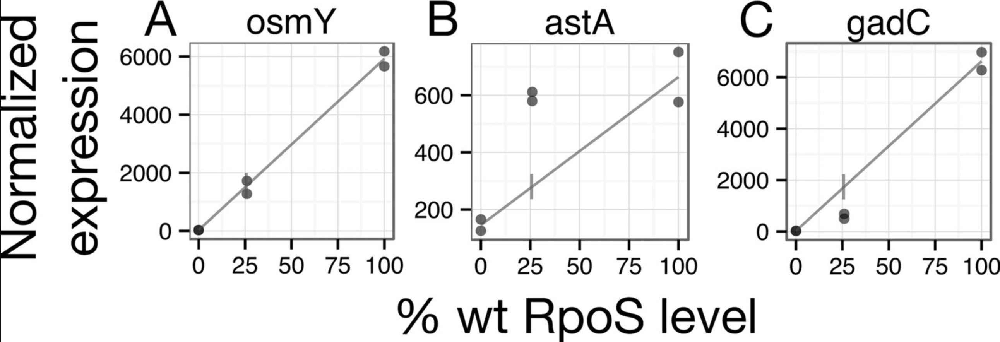
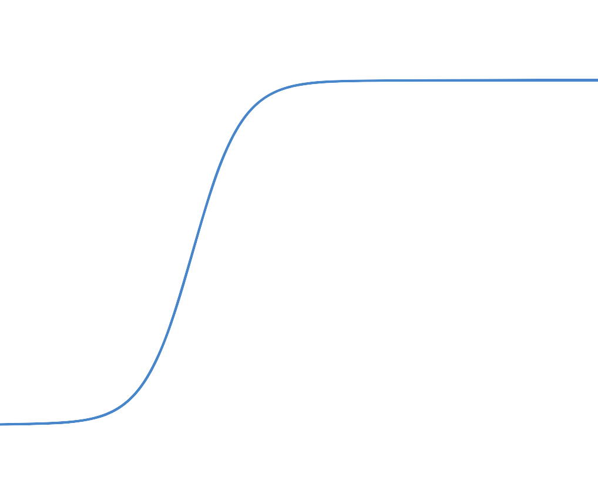
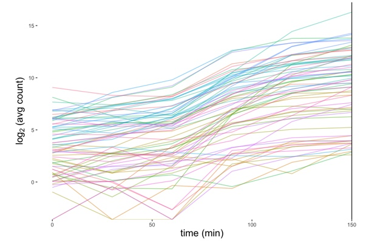
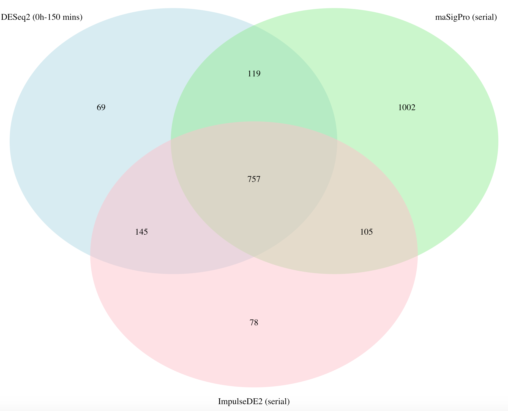

## Abstract
  *E. coli* possesses a general stress response that coordinates physiological responses to a variety of stressful stimuli including cell starvation during exponential growth. A key transcription factor in the general stress response, RpoS, is involved in the transcription of approximately one quarter of *E. coli's* genome. Groups of genes were previously classified by their kinetics with respect to RpoS concentration: genes with expressions that increase linearly with RpoS concentration ('linear' genes), genes that are transcribed *more* than anticipated under the linear hypothesis at low RpoS concentrations ('sensitive' genes), genes that are transcribed *less* than anticipated under the linear hypothesis at low RpoS concentrations ('insensitive' genes). Fong *et al.* proposed that the graded RpoS sensitivity of these genes could function as a mechanism to control the *timing* of genes invovled in *E. coli's* response to stress (Fong *et al* 2017). To address this question, DEGs were determined using a thoughtfully-constructed pipeline, and gene-wise sigmoidal models were fit to significant *E. coli* expression trajectories using ImpulseDE2. The variability and noise robustness of the models' parameters were assessed by simulations. Analysis of the biologically meaningful "onset time" parameter did not demonstrate a statistically nor biologically significant difference between the onset times for sensitive and insensitive genes. Implications and future research directions are discussed.

## Introduction
  E. coli possesses a general stress response to a variety of environmental stresses (Battesti *et al* 2011, Hengge 2011) ranging from osmotic shock to nutrient starvation. A key transcription factor coordinating this response is RpoS, which regulates one quarter of the bacteria's genome (preliminary data from Professor Dan Stoebel). Simple interpretations of transcriptional networks often invoke an analogy of an on/off switch, in which the presence of a stimulus turns some genes on and other genes off. However, these simple interpretations don't adequately describe the complex, dyanmic processes underlying many transcriptional responses to stimuli. Currently, there exists a limited understanding regarding the dynamic nature of transcriptional responses, and the well-annotated, heavily-studied genome of E. coli presents an excellent model to study these intricate regulatory circuits.
  
  The RpoS regulon is not a static, 'switch-like' network; rather, the RpoS regulon is a highly complex regulatory circuit influenced by several factors including the duration/degree of stress (Lange and Hengge-Aronis 1994), processes like transcription, translation, and mRNA degradation (Lange and Hengge-Aronis 1994), other proteins (Pratt and Silhavy 1998), competition between transcription factors for RNA polymerase (Farewell *et al.* 1998), and even strain type (Hryckowian *et al.* 2014, Chiang *et al.* 2011). Fong and colleagues previously showed that several genes' expression increases linearly with Rpos concentration: these were dubbed 'linear' genes. However, several genes didn't follow this linear trend. Several genes were transcribed *more* than anticipated under the linear hypothesis at low RpoS concentrations: these were called 'sensitive' genes. Other genes were transcribed *less* than anticipated under the linear hypothesis at low RpoS concentrations: these were dubbed 'insensitive' genes (Figure 1) (Fong *et al* 2017). Fong and colleagues hypothesized that sensitivity to Rpos could be a mechanism to control the **timing** of genes involved in the general stress response.
  
  
  
  We aimed to investigate this hypothesis using an *in silico* tool, ImpulseDE2. ImpulseDE2 is a serial Time Course (TC) Differential Expression tool which fits impulse/sigmoidal models to expression trajectories and compares these dynamics models to constant/reduced models to determine differential expression over time or between time courses. The key advantage of ImpulseDE2 is that its models are parametrized by *biologically meaningful* parameters (ex. onset time), allowing researchers to leverage the parameter values to directly address biological questions (Figure 2).
  
  
  
  We applied ImpulseDE2 to an time course (TC) RNA-Seq dataset generated by Professor Dan Stoebel. Two strains of *E. coli* - a WT strain and another strain, designated delta_RpoS, with the *rpos* gene knocked out - were allowed to grow exponentially for 150 minutes, inducing cell starvation and RpoS production (Figure 3). A thoughtful pipeline employing best-performing time course differential expression methods (DESeq2, NEXT maSigPro, and ImpulseDE2) was run on the dataset to identify differentially expressed genes. The onset time (t) parameter fitted by ImpulseDE2 was extracted for monotonically differentially expressed genes, and simulations were conducted to better understand and visualize the effects of dispersion, sample size, and outliers on all sigmoidal parameters. Then, statistical tests were applied to the timing parameters of sensitive and insensitive genes to test the hypothesis that graded sensitivity to RpoS coordinates the timing of gene expression in response to stress.


```{r, cache=TRUE, eval=T, echo=F}
#visualize RpoS kinetics
library(ggplot2)
rposconc<-read.csv("meanExpToStationaryRpoSLevels.csv", header=T)
ggplot(rposconc, aes(x=Time, y=meanRpoS, color=Trial))+geom_point(aes(size=meanDensity))+ggtitle("RpoS Kinetics During Cell Starvation")+labs(subtitle="3 replicates per trial, 3 trials")+ylab("meanRpoS conc. (M)")
```
Figure 3: RpoS kinetics over 150 min starvation time course.


## Methods
### Data Pre-Processing
RNA-Seq data was obtained in the form of read count data. Parsing code developed by Madison Hobbes was used to parse the gene identifiers, extract sequence type, gene names, and other useful information to subset the data.
Since this experiment focuses on the kinetics of gene expression, the read count data was filtered for Coding Sequences (CDS's). Rows with NA counts and 0 counts were filtered out, and duplicate genes were resolved.

```{r, cache=TRUE, include=FALSE, eval=TRUE}
#load required packages and functions
library(DESeq2)
library(tidyverse)
library(ImpulseDE2)
library(maSigPro)
library(Mfuzz)
library(cluster)
library(factoextra)
library(VennDiagram)
library(ggplot2)
library(gridExtra)
library(grid)
library(gridGraphics)
library(reshape2)
library(gdata)
foo<-function(){}
sigmoid_function<-function(b, h_0, h_1, t_1, t){
h_0 + (h_1-h_0)*(1/(1+exp(1)^(-b*(t-t_1))))
}

#read in data
allCounts <- read.csv("LB_Time_Course_GCA_000005845.2_ASM584v2_genomic_counts.tsv", header = T, sep = "\t")
```

```{r, echo=F, cache=TRUE, include=FALSE, eval=TRUE}
#collect the geneids
allCounts$GeneidBackup = allCounts$Geneid
# note that the geneids here are really long and contain a lot of information. We are going to parse those out, and first... make a separate column for gene feature (CDS, AS_CDS, IGR, etc).
```

```{r, include=F, cache=TRUE, include=FALSE, eval=TRUE}
allCounts <- allCounts %>% separate(GeneidBackup, c("feature", "rest"), sep="[:]")
allCounts %>% group_by(feature) %>% summarise(number_of_genes = n())
# Now, we must extract the genenames from each Geneid. However, each feature has a slightly different pattern, and we will need to do the features separately. 

# IGR's (this includes AS_IGRSs): 
# IGR stands for intergenic region which means a region between coding sequences or different types of RNA. Therefore, we'll have a start.bnum and end.bnum as well as a start.genename and end.genename. Note that not all genes will have a bnum (only CDS/AS_CDS do)
bnum = "b[0-9]{4}" # what do bnumbers look like?
genename = ",[a-z]{3}[A-Z,]." # what does a genename look like? this is regexp lingo
rna.name = ",rna[0-9].." # what does an RNA name look like?
igr <- allCounts %>% filter(feature %in% c("IGR", "AS_IGR"))
igr$GeneidBackup = igr$Geneid # store the Geneid
igr <- igr %>% separate(GeneidBackup, c("Geneid1", "Geneid2"), sep = "[/]") # separate the first part of the Geneid which talks about the IGR's start gene (Geneid1) and the last part of the IGR Geneid which talks about that IGR's end gene (Geneid2). 
igr$feature1 <- separate(igr, Geneid1, c("feature1", "rest"), sep = "[,]")$feature1
igr$feature1 <- separate(igr, feature1, c("rest", "feature1"), sep = "[()]")$feature1 #start feature
igr$feature2 <- separate(igr, Geneid2, c("feature2", "rest"), sep = "[,]")$feature2
igr$start.gene <- case_when( #start gene name: many possibilities!
    igr$feature1 == "CDS" ~ str_extract(igr$Geneid1, genename), #if the start feature was CDS, then the name is going to be genename style, so we extract a genename-type thing from Geneid1
    TRUE ~ str_extract(igr$Geneid1, rna.name)) #otherwise, it's going to have an RNA-style name, so we extract the rna.name from Geneid1
igr$end.gene <- case_when( #end gene neame: similar to above!
    igr$feature2 == "CDS" ~ str_extract(igr$Geneid2, genename), # if the end feature was CDS, then we're looking for a genename-type bit from Geneid2
    TRUE ~ str_extract(igr$Geneid2, rna.name)) #otherwise, it must be an RNA-style label of some sort. 
igr$start.bnum <- case_when(
    igr$feature1 == "CDS" ~ str_extract(igr$Geneid1, bnum), #bnums only exist for CDS, so we check if the feature is CDS before extracting a bnum from Geneid1
    TRUE ~ "none") # if not CDS, then no bnum exists so we can put "none"
igr$end.bnum <- case_when(
    igr$feature2 == "CDS" ~ str_extract(igr$Geneid2, bnum), #same thing as above but for end bnum
    TRUE ~ "none")
# now get rid of all those pesky commas that got into our start.gene labels. I could have not included the punctuation in my regex pattern, but then str_extract() might have gotten confused with a less specific pattern
igr <- igr %>% separate(start.gene, into = c("comma", "start.gene"), sep = "[,]") %>% select(-comma) %>% separate(end.gene, into = c("comma", "end.gene"), sep = "[,]") %>% select(-comma)
allCounts <- full_join(igr, allCounts) #add this new information to allCounts!
```

```{r, echo=F, warning = F, message = F, include=F, cache=TRUE, eval=TRUE}
# CDS
# have bnum and genename columns
# left join to allCounts
genename = ":[a-z]{3}.." #new genename pattern
#bnum pattern stays the same
cds <- allCounts %>% filter(feature %in% c("AS_CDS", "CDS")) 
cds$genename <- str_extract(cds$Geneid, genename) #extract those genenames!
cds$bnum <- str_extract(cds$Geneid, bnum) # extract them bnums!
#get rid of the pesky colon that was part of the pattern
cds <- cds %>% separate(genename, into = c("colon", "genename"), sep = ":") %>%
  select(-colon)
allCounts <- full_join(allCounts, cds) #add the new info to allCounts
```

```{r, echo=F, warning = F, message = F, include=F, cache=TRUE, eval=TRUE}
#ncRNA
#ncRNA doesn't have bnums, but id's which we'll put in the genename column
rna.name = ":rna[0-9].." #new rna.name pattern
rna <- allCounts %>% filter(feature %in% c("ncRNA", "AS_ncRNA"))
rna$genename <- str_extract(rna$Geneid, rna.name) #record those rna.names
rna <- rna %>% separate(genename, into = c("colon", "genename"), sep = ":") %>%
  select(-colon) #get rid of colon
allCounts <- full_join(allCounts, rna) #update allCounts with ncRNA names!
#rRNA
rRNA <- allCounts %>% filter(feature %in% c("rRNA", "AS_rRNA"))
rRNA$genename <- str_extract(rRNA$Geneid, rna.name) #same rna.name pattern exists as above, so extract those rna.names! And store the result as genename - I know. This is just for convenience's sake so we have a common column to refer to when we want the short hand name for a gene. 
rRNA <- rRNA %>% separate(genename, into = c("colon", "genename"), sep = ":") %>%
  select(-colon) #get rid of that colon
allCounts <- full_join(allCounts, rRNA) #update allCounts
#tRNA -- analogous to rRNA above. 
tRNA <- allCounts %>% filter(feature %in% c("tRNA", "AS_tRNA"))
tRNA$genename <- str_extract(tRNA$Geneid, rna.name)
tRNA <- tRNA %>% separate(genename, into = c("colon", "genename"), sep = ":") %>%
  select(-colon)
allCounts <- full_join(tRNA, allCounts)
# remove the NA rows we just created by full_joining while adding the ncRNA, rRNA, tRNA genenames
allCounts <- filter(allCounts, feature %in% c("IGR", "AS_IGR") | genename != "NA")

#filter by CDS, NA, 0 sums, resolve duplicates
ecounts<-allCounts %>% filter(feature=="CDS")
ecounts<-ecounts[rowSums(is.na(ecounts)) != ncol(ecounts), ]
ecounts<-subset(ecounts, rowSums(ecounts[,2:37])>0)
ecounts<- ecounts %>% dplyr::distinct(genename, .keep_all=TRUE)
rownames(ecounts)<-ecounts$genename
ecounts<-ecounts[,2:37]
head(ecounts)
```

### Identifying Differentially Expressed Genes
  Three *in silico* differential expression tools were employed to identify DEGs between the WT and delta_RpoS time courses. Previous research shows that two-sample comparisons using DESeq2 and serial tools maSigPro and ImpulseDE2 are the best performing methods to identify differentially expressed genes in TC experiments. Morever, combining gene lists generated by multiple tools reduces false positives without compromising sensitivity and is thus recommended for optimal DEG identification in TC experiments (Spies *et al.* 2019). 
  
  **DESeq2** is an algorithm that models the read counts using a negative binomial distribution and uses a trimmed mean method (TMM) to normalize the read count data across between-sample effects. DESeq2's main innovation is its Bayesian Shrunken Dispersion and LFC estimates, which improve stability and interpretability of these estimates (Love *et al* 2014). DESeq2 is one of the most widely accepted and empolyed algorithms for differential expression analysis. However, DESeq2 is not built to analyze serial (time course) data, and its categorical treatment of serial data leads to loss in predictive power. Thus, DESeq2 alone is an insufficient method to identify DEGs in TC experiments.
  
  **NEXT maSigPro** (Nueda *et al.* 2014) is a differential expression algorithm designed to analyze serial/TC RNA-Seq data. maSigPro models the gene expression value using polynomial regression with a NB Generalized Linear Model. The model's parameters are fit using maximum likelihood, and the log likelihood ratio test is applied to the full model and the null model (a flat/alternative model fit to a control time course). In the second step of maSigPro, the goodness of fit, R^2^, is computed for each optimized gene model, allowing filtering based on genes with clear expression trends. maSigPro requires data to be normalized *a priori* (we used the TMM method implemented through DESeq2) and contains a naive dispersion estimate of 10, which according to the authors does not have a substantial impact on downstream DEG identification (Nueda *et al.* 2014). maSigPro is a robust DE tool designed for analysis and interpretation of serial/TC RNA-Seq data.
  
  **ImpulseDE2** (Fischer *et al.* 2018) is another differential expression algorithm designed to analyze serial/TC RNA-Seq data. ImpulseDE2 fits impulse/sigmoidal models to the read count data by estimating the parameters using the Broyden–Fletcher– Goldfarb–Shanno algorithm.  Gene-wise dispersion estimates are generated using the bayesian shrinkage approach used in DESeq2. Differential expression is assessed using the log likelihood ratio test comparing the likelihood of the alternative and null (flat or control fit) models.
  
  Using a shiny app created by Annie Cohen, we noticed that many of E. Coli's DEGs appeared montonically differentially expessed. To capture this global expression change, we ran the categorical DE tool DESeq2 a two-sample contrast across the delta_Rpos and WT strains at the final time point (150min), when expression differences between the two time courses were putatively maximized. maSigPro was run with default arguments and results were filtered by R^2^ of 0.6 to obtain DEGs with cognizable expression trends. ImpulseDE2 was run with defaults and with the specification to differentiate between transient (impulse) and monotonic (sigmoidal/linear) DEGs.
  
  
  
  Genes that were identified as significantly differentially expressed at a Benjamini-Hochberg corrected p value of less than 0.01 by two or more tools were included in our DEG list. 1126 genes were identified as DE (Figure 4).
  
  
```{r DE Tools, cache=TRUE, eval=T, echo=FALSE, warning=F, message=F, error=F}
####################################################################################################################
#DESeq2
####################################################################################################################
colidesign<-data.frame(time=as.factor(rep(c("0", "30", "60", "90", "120", "150"), 6)), rep=as.factor(c(rep(1, 12), rep(2,12), rep(3,12))), treatment=as.factor(c(rep("WT",6), rep("treat",6), rep("WT",6), rep("treat",6), rep("WT",6), rep("treat",6))))

ddsecoliCountTable <- DESeqDataSetFromMatrix(
  countData = ecounts,
  colData = colidesign,
  design = ~ time + treatment +treatment:time)

#ID'ed 1090 DEGs w/ padj<0.01
ecolidds<-DESeq(ddsecoliCountTable)
res<-results(ecolidds, contrast=list(c("treatment_WT_vs_treat","time150.treatmentWT")))
res<-res[complete.cases(res),]
res<- res[res$padj<0.01,]

#####
#ImpulseDE2
#####
stoebeldesign<-data.frame(Sample=colnames(ecounts), Condition=c(rep("case",6), rep("control",6), rep("case",6), rep("control",6), rep("case",6), rep("control",6)), Time=rep(c(0,30,60,90,120,150),6))

impulse_ecoli<-ImpulseDE2::runImpulseDE2(as.matrix(ecounts), stoebeldesign, boolCaseCtrl=TRUE, vecConfounders=NULL, scaQThres = 0.01, boolIdentifyTransients = TRUE)


###################################################################################################################################
#Serial expression tool: NEXT maSigPro
###################################################################################################################################

#set up design
Time<-rep(c(0,30,60,90,120,150),6)
Replicate<-rep(1:3, 12)
Control<-c(rep(0, 6), rep(1, 6), rep(0, 6), rep(1, 6), rep(0, 6), rep(1,6))
delta_Rpos<-c(rep(1, 6), rep(0, 6), rep(1, 6), rep(0, 6), rep(1, 6), rep(0, 6))
edesign<-cbind(Time, Replicate, Control, delta_Rpos)
rownames(edesign)<-colnames(ecounts)

#run maSigPro on DESeq2 Normalized Counts, theta=10, Q=0.01
normecounts<-as.data.frame(counts(ecolidds, normalized=TRUE))
stobdesign<-make.design.matrix(edesign, degree=5)

#ID DEGs
fits<-p.vector(normecounts, stobdesign, Q=0.01, MT.adjust = "BH", min.obs=6, counts=TRUE)
#variable selection procedure to ID variables for each gene
tsep<-T.fit(fits, step.method = "backward", alfa=0.01)

#Get sig genes between delta_RpoS and Control
sigs <- get.siggenes(tsep, rsq = 0.6, vars = "groups")
maSigProGenes<-sigs$summary$delta_RposvsControl

area1 <- length(intersect(rownames(res),maSigProGenes))
area2<- length(intersect(impulse_ecoli$vecDEGenes,rownames(res)))
area3 <- length(intersect(maSigProGenes, impulse_ecoli$vecDEGenes))
area123<-length(intersect(intersect(maSigProGenes, impulse_ecoli$vecDEGenes), intersect(maSigProGenes,rownames(res))))

#draw venn diagram of DEG overlaps
draw.triple.venn(area1= length(rownames(res)), area2 = length(maSigProGenes), area3= length(impulse_ecoli$vecDEGenes), n12=area1, n23=area3, n13=area2, n123=area123, category = c("DESeq2 (0h-150 min)","maSigPro (serial)", "ImpulseDE2 (serial)"), lty = rep("blank",3), fill = c("light blue", "light green", "pink"))
```

```{r DEGs, cache=TRUE, eval=T}
###################################################################################################################
#Generate final DEG list: 1126 genes
###################################################################################################################
ecoli_DEGs<-unique(c(intersect(rownames(res),maSigProGenes), intersect(impulse_ecoli$vecDEGenes,rownames(res)), intersect(maSigProGenes, impulse_ecoli$vecDEGenes)))
```

### Simulations for Assessment of Sigmoidal Model Parameters
Simulations were conducted to understand the effects of dispersion, sample size, and outliers on the sigmoid model's parameters. The basic simulation structure takes in mean read counts estimated from the fit of a sigmoidal model to a real *E. coli* expression trajectory, and generates 100 simulated expression trajectories by adding NB noise to each profile. The amount of noise added to each profile depends on the DESeq2-estimated dispersion parameter obtained for each gene. Then, sigmoidal models are fit to the simulated trajectories using ImpulseDE2, and the distribution of simulated parameters are compared to the initial parameter values.

## Results
### Visualizing onset times for DEGs and Insensitive & Sensitive Genes
For genes identfied as differentially expressed, onset timing parameters were extracted and plotted in a density plot (Figure 4). The bimodality/trimodality of the plot suggests that there are groups of *E. coli* genes with similar onset kinetics. Interestingly, onset time params for genes identified as *transiently* differentially expressed show strong bim

```{r Visualizing t params: mono, impulse, sens, insens, cache=TRUE, echo=F, eval=T}
#########
#Visualize t params from monotonic genes, impulse genes
#########
DEmono<- impulse_ecoli$dfImpulseDE2Results[impulse_ecoli$dfImpulseDE2Results$isMonotonous==TRUE,] %>% filter(padj<0.01)
DEtrans<-impulse_ecoli$dfImpulseDE2Results[impulse_ecoli$dfImpulseDE2Results$isTransient==TRUE,] %>% filter(padj<0.01)
DEother<-impulse_ecoli$dfImpulseDE2Results %>% filter(padj<0.01) %>% filter(isTransient==FALSE) %>% filter(isMonotonous==FALSE)

#Find sensitive and insensitive genes
sensitivity<-read.xls("Sensitivity.xlsx")
#split the dataframe by sensitivity level
sensitivity<-split(sensitivity, sensitivity$sensitivity)
sensitive<-sensitivity$sensitive
linear<-sensitivity$linear
insensitive<-sensitivity$insensitive

#pull out sigmoid params for each of the monotonic DEGs
monoDE<-DEmono$Gene
monoparamsmat<-matrix(ncol=4, nrow=length(monoDE))
for (i in 1:length(monoDE)){
   monoparamsmat[i,]<-impulse_ecoli@lsModelFits[["case"]][[monoDE[i]]][["lsSigmoidFit"]][["vecSigmoidParam"]]}
monoparamsdf<-as.data.frame(monoparamsmat)
colnames(monoparamsdf)<-c("beta", "h0", "h1", "t")
rownames(monoparamsdf)<-monoDE

#sensitive params
sensvec<-na.omit(sensitive$geneName)
sensitivedf<-as.data.frame(matrix(ncol=4, nrow=length(sensvec)))
for (i in 1:length(sensvec)){
  index=match(sensvec[i], rownames(monoparamsdf))
  sensitivedf[i,]<-monoparamsdf[index,]}
colnames(sensitivedf)<-c("beta", "h0", "h1", "t")

#insenstive params
insensvec<-na.omit(insensitive$geneName)
insensitivedf<-as.data.frame(matrix(ncol=4, nrow=length(insensvec)))
for (i in 1:length(insensvec)){
  index=match(insensvec[i], rownames(monoparamsdf))
  insensitivedf[i,]<-monoparamsdf[index,]} 
colnames(insensitivedf)<-c("beta", "h0", "h1", "t")

#t params of montonic genes, looks somewhat bi/trimodal
ggplot(monoparamsdf, aes(x=t))+geom_density(color="blue", fill="cyan")+ xlim(50,75)+ggtitle("Distribution of sigmoid t params of 740 monotonic E. coli DEGs")

#t1 params of transient genes... definitely bimodal
transDE<-na.omit(DEtrans$Gene)
transparamsmat<-matrix(ncol=6, nrow=length(transDE))
for (i in 1:length(transDE)){
   transparamsmat[i,]<-impulse_ecoli@lsModelFits[["case"]][[transDE[i]]][["lsImpulseFit"]][["vecImpulseParam"]]}
transparamsdf<-as.data.frame(transparamsmat)
colnames(transparamsdf)<-c("beta", "h0", "h1", "h2", "t1", "t2")
rownames(transparamsdf)<-transDE
ggplot(transparamsdf, aes(x=t1))+geom_density(color="blue", fill="cyan", alpha=0.5)+ xlim(0,100)+ggtitle("Distribution of 40 impulse t1 params of monotonic E. coli DEGs")

#pull out t/t1 params of all sensitive genes, plot distribution of onset times for sensitive
sens_on<-matrix(ncol=1,nrow=0)
for (i in 1:length(sensitive$geneName)){
  if (sensitive$geneName[i] %in% rownames(monoparamsdf)){
    index=match(sensitive$geneName[i], rownames(monoparamsdf))
    sens_on<-rbind(sens_on, monoparamsdf$t[index])}
  if (sensitive$geneName[i] %in% rownames(transparamsdf)){
    index=match(sensitive$geneName[i], rownames(transparamsdf))
    sens_on<-rbind(sens_on, transparamsdf$t1[index])}
  if (sensitive$geneName[i] %in% linear$geneName){
    foo()
  }}
sens_on<-as.data.frame(sens_on)
colnames(sens_on)<-"On_times"
ggplot(sens_on, aes(x=On_times))+geom_density(color="blue", fill="cyan", alpha=0.5)+ xlim(50,100)+ggtitle("Distribution of onset times for 90 Sensitive E. coli DEGs")

#pull out t/t1 params of all insensitive genes, plot distribution of onset times for insensitive
insens_on<-matrix(ncol=1,nrow=0)
for (i in 1:length(insensitive$geneName)){
  if (insensitive$geneName[i] %in% rownames(monoparamsdf)){
    index=match(insensitive$geneName[i], rownames(monoparamsdf))
    insens_on<-rbind(insens_on, monoparamsdf$t[index])}
  if (insensitive$geneName[i] %in% rownames(transparamsdf)){
    index=match(insensitive$geneName[i], rownames(transparamsdf))
    insens_on<-rbind(insens_on, transparamsdf$t1[index])}
  if (insensitive$geneName[i] %in% linear$geneName){
    foo()
  }}
insens_on<-as.data.frame(insens_on)
colnames(insens_on)<-"On_times"
ggplot(insens_on, aes(x=On_times))+geom_density(color="red", fill="magenta", alpha=0.5)+ xlim(50,100)+ggtitle("Distribution of onset times for 18 Insensitive E. coli DEGs")

#rbind all the onset times, plot densities of onset times for both sensitive and insensitive
sens_on$type<-rep("Sensitive", dim(sens_on)[1])
insens_on$type<-rep("Insensitive", dim(insens_on)[1])
on_times<-rbind(sens_on, insens_on)
#plot the densities of the onset times
ggplot(on_times, aes(x=On_times, color=type, fill=type))+geom_density(alpha=0.5)+ xlim(50,100)+ggtitle("Distribution of onset times for 90 Sensitive & 18 Insensitive E. coli DEGs")

#Run Wilcox Rank Sum test on these t params, trimming off outliers (>70) for sens_on
wilcox.test(sens_on$On_times[sens_on$On_times<70], insens_on$On_times, alternative="two.sided", mu=0, var.equal=FALSE, conf.level=0.95)
#nearly significant... not significant at the p=0.05 level

#extract peak t params for later plotting
sens_peak<-density(sens_on$On_times)$x[which.max(density(sens_on$On_times)$y)]
insens_peak<-density(insens_on$On_times)$x[which.max(density(insens_on$On_times)$y)]
```

### Simulations
To better understand the effects of dispersion, sample size, and outliers on the sigmoid model's biologically-meaningful parameters, simulations were conducted based off real, gene-wise data from *E. coli* DEGs. 

### Effect of Dispersion on Sigmoid Parameters
The simulation pipeline was conducted under three conditions: with the *a priori* DESeq2-shrunken dispersion parameter estimates, a 100-fold *increase* in the dispersion parameter estimate (i.e. a 100-fold reduction in the noise caused by dispersion), and 100-fold *decrease* in the dispersion parameter estimate (i.e. a 100-fold increase in the noise caused by dispersion). 
As evidenced by the following plots, decreasing the dispersion parameter by 100 fold resulted in less correlated expression trajectories and a profound shift in the distribution of peak heigh towards 0. However, the onset time (t) param appeared relatively robust to the noise, as the initial value represented the 72nd quantile, only a few minutes greater than the peak of simulated values.
Increasing the dispersion parameter by 100-fold
